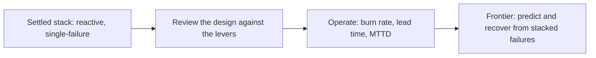

# Production failure modes — review, operations & frontier roadmap

## Roadmap: reviewing, operating & the frontier

**What this section covers.** How an expert zooms out from individual guards to the whole system:
the levers of the reliability design space, how to critique a design in a review or interview, the
operational signals you watch when it's live, and the open frontier the settled stack doesn't yet
solve.

**The ideas you'll meet:**

- **Five reliability levers** — detection surface, mitigation policy, containment bounds, prevention gates, and rollout safety.
- **Common → SOTA → antipattern** — the ladder for judging any reliability subsystem, and the toy / prototype / demo-ready / production-ready rating for a whole design.
- **Google SRE canon** — error budgets (a spendable failure tolerance) and blameless postmortems that feed fixes back into the catalog and gates.
- **OWASP LLM Top 10** — the field checklist of LLM-specific risks to enumerate what can go wrong.
- **Error-budget burn rate** — how fast you're spending the budget; a fast burn is the signal to freeze risky rollouts.
- **Silent-regression lead time / MTTD** — the gap between a regression shipping and being noticed, the number the frontier drives toward zero.
- **Guardrail-trigger rate** — how often guards fire; a rising trend is a leading indicator of degradation before users see errors.
- **Failure prediction & multi-failure recovery** — the open frontier: forecast a failure before it lands and degrade cleanly when several stack at once.

**Why it matters.** Knowing the catalog and the guards makes you competent; being able to review a
design against the levers, watch the right operational signals, and name the unsolved frontier is what
reads as senior in a design review or an interview.
