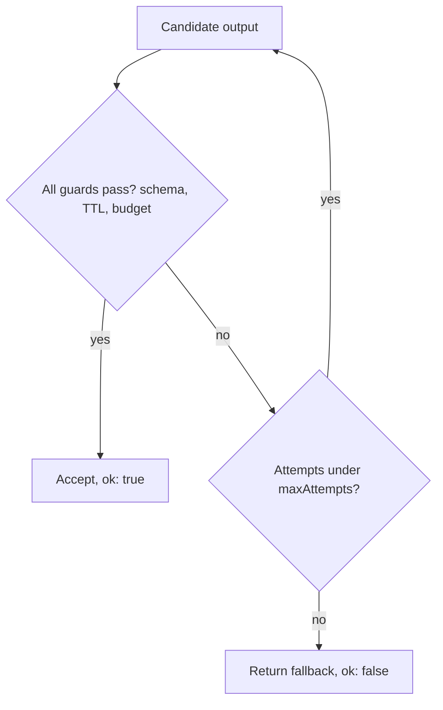

# Production failure modes — guard suites & rollout safety roadmap

## Roadmap: guard suites & rollout safety

**What this section covers.** The concrete controls that implement mitigation and prevention — TTL
freshness checks, budgets and loop detection, a composed `runSafely` guard suite, and the CI eval
gates and canaries that keep a quality regression from ever reaching users.

**The ideas you'll meet:**

- **TTL / freshness check** — stamp each chunk with a timestamp or version and refuse, flag, or re-retrieve past the threshold to catch stale retrieval.
- **Budget** — a hard cap on steps, tokens, or dollars that halts a runaway agent when exceeded.
- **Loop detection** — spotting repeated actions or states and tripping when an agent gets stuck.
- **`runSafely` guard suite** — compose guards so a candidate is accepted only if it passes every one; defense in depth.
- **Bounded retries** — retry only up to `maxAttempts`, because an unbounded retry loop is itself a runaway/cost failure.
- **CI eval gate** — score each change against a held-out set and block the merge when it falls below threshold.
- **Canary** — route a small live-traffic slice to the new version and watch quality, latency, and cost against the baseline.

**Why it matters.** Runtime guards and rollout guards close different halves of the loop — one catches
loud, per-request failures instantly, the other catches the silent regressions that never throw — and
a fallback that isn't reported (`ok: false`) just becomes another silent failure.
