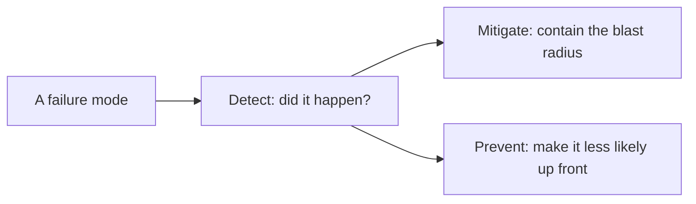

# Production failure modes — the detect, mitigate, prevent roadmap

## Roadmap: the detect → mitigate → prevent playbook

**What this section covers.** The framework that turns a pile of guards into a playbook: for every
failure in the catalog, three distinct questions have three distinct answers — did it happen
(detection), how do we contain it (mitigation), and how do we make it less likely (prevention) — seen
most clearly in the validate-repair-fallback pattern for malformed output.

**The ideas you'll meet:**

- **Detection** — *did the failure happen?* Validators, freshness checks, and eval monitors that surface the problem.
- **Mitigation** — *now that it happened, how do we limit the blast radius?* Fallbacks, budgets, and circuit breakers that contain the damage.
- **Prevention** — *how do we make it less likely up front?* Schemas, TTLs, and CI gates applied before anything ships.
- **Validate-repair-fallback** — validate against the schema, re-ask or repair on failure, then degrade to a safe default rather than crash.
- **Fallback** — a safe default returned so the caller always gets a valid value instead of an exception or a silently-wrong one.

**Why it matters.** Detection, mitigation, and prevention are three different jobs; a system that
blurs them either over-reacts or leaves gaps, so naming which one you're doing is what makes a
reliability design legible.
