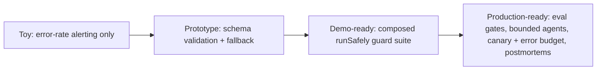

## Reviewing a reliability design

**In brief.** Critiquing someone's reliability design — in a review or an interview — means asking
where on the detect → mitigate → prevent playbook they spent their effort, and whether they covered
the **loud** failures, the **silent** ones, or both. Almost every weak design is weak the same way:
it instruments availability and calls that quality.

**The five levers.**

- **Detection surface** — runtime **validators** (schema/allowlist, freshness/TTL) that inspect what
  the model said, versus **eval monitoring** that scores quality over time. Validators catch loud,
  per-request failures cheaply and catch nothing silent; eval monitoring is the only thing that sees
  quality drift. Budgeting instrumentation from error-rate dashboards alone is the classic trap.
- **Mitigation policy** — what happens once a guard trips: validate-repair-fallback, refuse or
  re-retrieve on stale, halt on budget breach. The lever is how gracefully you degrade, not whether
  you crash. The cost is extra latency and tokens, plus a masked failure if the degradation is
  unlogged.
- **Containment bounds** — hard **budgets** (steps, tokens, dollars) plus **loop detection**, which
  bound cost and blast radius whatever the model does, at the risk of cutting off a legitimately long
  task. Validators and a fallback contain per-call output failures; none of them bounds an agent.
- **Prevention gates** — **CI eval gates** that block a merge when a held-out score drops, plus
  strict schemas, constrained decoding, and TTL with re-indexing. They trade merge speed for safety.
- **Rollout safety** — **canaries** and **error budgets**: a small live-traffic slice watched against
  the baseline, with the error budget governing how much risk a change may spend.

**The review checklist.**

- Does it inspect output **content**, or only whether the call returned? Error rate counts only loud
  failures — a hallucinated citation or a stale-retrieval answer returns a clean 200 and never moves
  it. If detection is error-rate dashboards, stop there: the design is blind to everything silent.
- Is there an **eval gate** on quality-affecting changes? A prompt, model, or retrieval tweak is
  exactly the change that regresses silently, so every runtime guard stays green while quality drops.
  Runtime guards and an eval gate are complementary, not substitutes.
- What happens when a guard **trips**? A real design names its mitigation and degrades; "it just
  works" is not an answer.
- Are agents **bounded** — a budget on steps, tokens, or cost, and loop detection? A safe fallback
  does not make an agent terminate, and a bigger model or more tools does not bound spend.
- How do risky changes **roll out**, and what closes the loop? Canary plus error budget, and blameless
  postmortems feeding fixes back into the catalog and gates — or the same failure recurs.

**The antipatterns.**

- **Loud-error focus** — everything invested in exception handling and error dashboards while nothing
  inspects output content, so a near-zero error rate is read as evidence of correctness. A crash pages
  someone in minutes; a quietly degraded answer ships to users for weeks.
- **No guardrails at all**, **no CI eval gate** (so any tweak can silently regress), and **no
  postmortems** (so the incident repeats). Each passes a demo and erodes trust under real traffic.

**Why it matters.** How many of the checklist questions a design answers is exactly what rates it
**toy** (error-rate alerting called monitoring), **prototype** (validation and a fallback),
**demo-ready** (a full guard suite), or **production-ready** (also gating quality, bounding agents,
rolling out behind a canary and error budget, and running postmortems) — and treating silent
regressions rather than loud errors as the hard case is what reads as senior.
