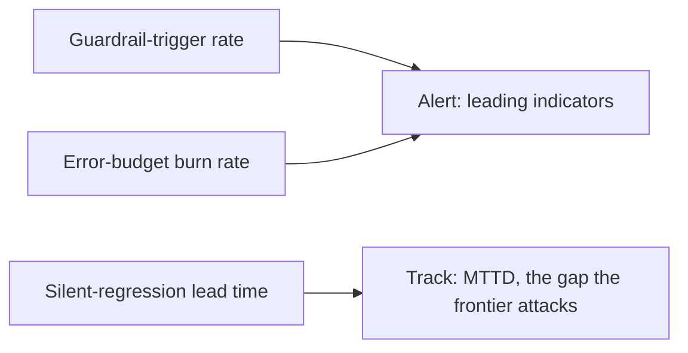

## The frontier & operating for failure

**In brief.** The settled stack — validate-repair-fallback, freshness/TTL, budgets and loop
detection, CI eval gates, canaries — is **reactive and single-failure**: it catches what it can
measure, one mode at a time, after it happens. The open problems and the live dashboard attack that
same weakness from two sides, because the failures that matter most never move the error rate.

**The open problems.**

- **Catching silent regressions early** — the live frontier. A CI eval gate blocks a quality drop it
  can **measure on a held-out set**; a canary catches a regression that shows up **in the slice it
  watches**. A confident, well-formed, wrong answer that slips past both — a drift the held-out set
  never probes and the canary window never surfaces — still returns a clean 200, so nothing pages
  anyone. The direction to watch is detection that shrinks the gap between "shipped" and "noticed":
  richer online eval sampling, drift signals on output **content**, not on error rate.
- **End-to-end failure prediction** — reading leading signals (a rising fallback rate, a creeping eval
  score) as a **forecast**, so a failure is seen before it lands rather than reacted to after the
  incident. A named open problem, not a shipped pattern.
- **Graceful multi-failure recovery** — single-failure playbooks are mature (repair malformed JSON,
  refuse on stale retrieval, halt on budget breach). The frontier is **compositional**: failures stack
  and compound — stale retrieval feeding a malformed tool call feeding a budget breach — and the hard
  part is degrading cleanly instead of the guards fighting each other or the system collapsing.

**The signals when it is live.**

- **Error-budget burn rate** — your SLO implies a spendable budget of allowed failures; burn rate is
  how fast you are consuming it. A fast burn (a burst of breaches or fallbacks against the SLO) is the
  signal to **freeze risky rollouts and stop shipping**, because the error budget governs how much
  risk a change may spend before the door closes.
- **Silent-regression detection lead time** — the gap between a regression **shipping** and being
  **noticed**. This is the number the frontier tries to drive toward zero; a growing lead time means
  silent drift is outrunning your detection, and it is the operational proxy for the hardest open
  problem.
- **Mean-time-to-detect and mean-time-to-recover** — **MTTD** moves together with lead time and is the
  one that hurts for silent failures: a loud crash has near-zero MTTD, but a hallucinated-citation
  regression can run for days. **MTTR** is what the detect → mitigate → prevent loop and blameless
  postmortems are for.
- **Guardrail-trigger rate** — how often the guards actually fire: repair degradations, TTL refusals,
  budget halts, loop-detector trips. A rising trigger rate is a **leading** indicator that the model or
  its inputs are degrading before users see errors, because the guards are absorbing the damage. Watch
  the trend, not the level.

**Why it matters.** Alert on guardrail-trigger rate and error-budget burn rate as the leading
indicators, track silent-regression lead time and MTTD as the numbers that expose what error
dashboards miss, and never reason about health from error rate alone — the settled stack is reactive
and single-failure, and naming which of predictive or compositional a system lacks is the expert move.
