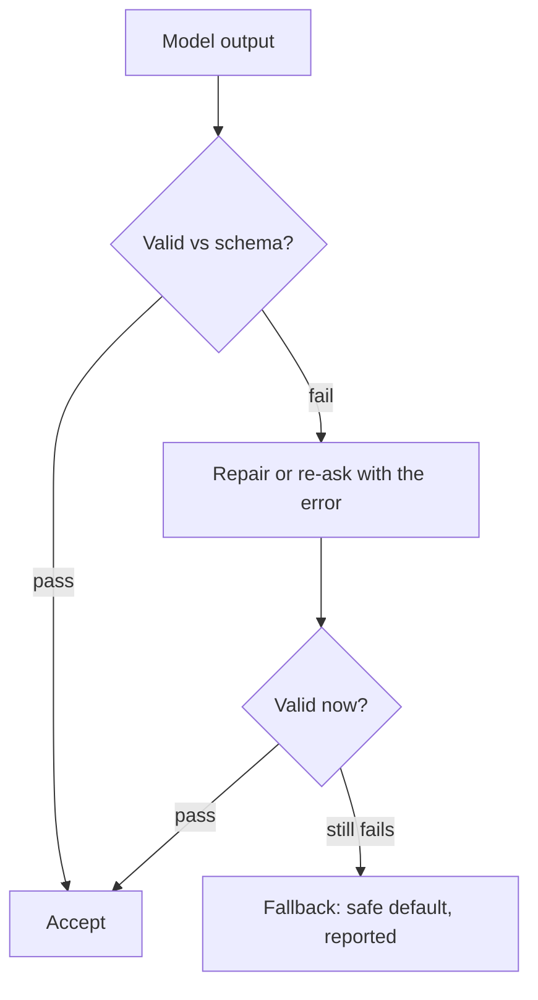

## Repair, fallback & containment

**In brief.** The guard suite names the controls; this is what actually happens when one trips. Two
mechanics carry most of the weight — **validate-repair-fallback** for bad output, and the
**budget plus loop detection** pair for an agent that will not stop. Both are mitigation: they act
after the failure already exists, and both only work because they are bounded.

**The mechanics.**

- **Validate** — parse the candidate against the schema, or check a tool call against the
  allowlist. This is the detection step: it establishes that the failure happened, nothing more.
- **Repair or re-ask** — re-prompt the model, often feeding the parse error back to it, or repair
  the string directly. Retrying the **identical** prompt forever is not this pattern — it neither
  repairs anything nor bounds cost.
- **Fallback** — degrade to a safe default so the caller **always** gets a valid value instead of a
  crash or garbage shipped downstream. It exists because validation and repair are not guaranteed to
  succeed: re-asking can keep failing, and something has to terminate the sequence safely.
- **Report the fallback** — return an `ok: false` alongside it. A fallback nobody can see is just
  another silent failure wearing a guard's clothes.
- **Bounded retries** — attempts are capped at `maxAttempts`. An **unbounded** retry loop is itself
  the runaway/cost failure you were guarding against.
- **Budget** — a hard cap on steps, tokens, or dollars that halts an agent **once the cap is
  exceeded**. It bounds the worst case regardless of what the model does.
- **Loop detection** — spots repeated actions or states and trips when the agent is **stuck**. A
  different trigger from the budget's ceiling, which is why the two are paired rather than swapped
  for each other. Neither a bigger model nor more tools bounds a runaway agent; only these do.
- **Preventing instead of repairing** — strict schemas and constrained decoding stop invalid output
  from being emitted at all. Hallucinated tool calls take the same shape: validate against the
  allowlist, re-ask on failure, fall back to refusing the action.

**Why it matters.** Every guard in the suite ends in the same three questions — did you detect it,
did you bound what you did about it, and does the degraded path stay visible — and a mitigation that
misses any one of them becomes the next failure mode rather than the fix for it.
