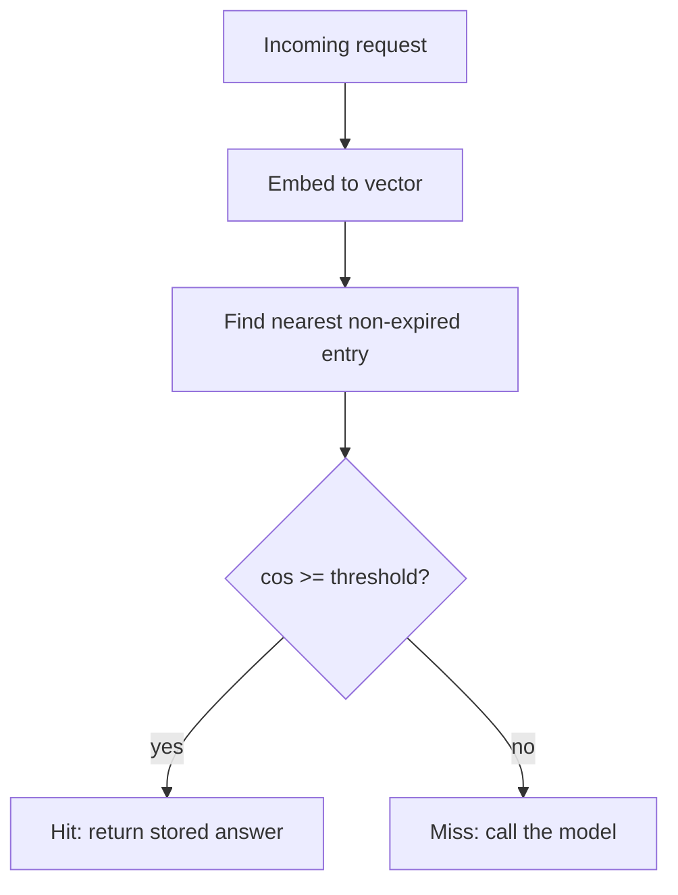

# Build it: a semantic cache

## How a semantic cache decides a hit

A prefix cache hits on an *identical* leading-token match. A **semantic** cache is fuzzier: it embeds
the incoming request, compares that vector against the embeddings of stored entries, and returns a
stored answer when something is "close enough." The whole design lives in three decisions: the
**similarity measure**, the **threshold**, and **expiry (TTL)**.

The standard similarity is **cosine similarity** — the normalized dot product, which measures the
*angle* between two vectors and ignores their magnitude:

`cos(a, b) = (a · b) / (‖a‖ · ‖b‖)` — ranges from -1 to 1; identical direction = 1.

A lookup is a **hit** when the most-similar *non-expired* entry has `cos ≥ threshold`; otherwise it's a
**miss**. Example with `threshold = 0.9`: a stored entry embedded as `[1, 0]` is a hit for a query
`[1, 0]` (cos = 1) and a miss for `[0, 1]` (cos = 0).

## Thresholds TTL and false positives

- **Threshold too low → false positives.** This is the failure mode unique to semantic caching:
  a genuinely *different* question is "close enough," so you return a confidently **wrong** cached
  answer. That's far worse than a miss. Tune the threshold conservatively for high-stakes answers.
- **Threshold too high → few hits**, and the cache stops paying for itself. Threshold is the dial
  between savings and correctness.
- **TTL / expiry.** Cached answers go stale. Treat any entry older than the TTL (`now - storedAt >
  ttl`) as a **miss** so stale content isn't served. Expiry is your staleness guard.
- **Pick the nearest, then gate.** Compare against stored entries, take the most similar one, and only
  return it if it clears the threshold — don't return the first entry that happens to be near.
- **Multi-tenant safety (preview of a later topic):** the cache key/namespace must include the tenant
  so one user's cached answer can never surface for another. A tenant-blind semantic cache leaks.

**Why it matters.** Building the cache makes the three decisions concrete — similarity, threshold, and
expiry are exactly the knobs a real semantic layer exposes, and each one is a place a wrong or stale
answer can slip through.
