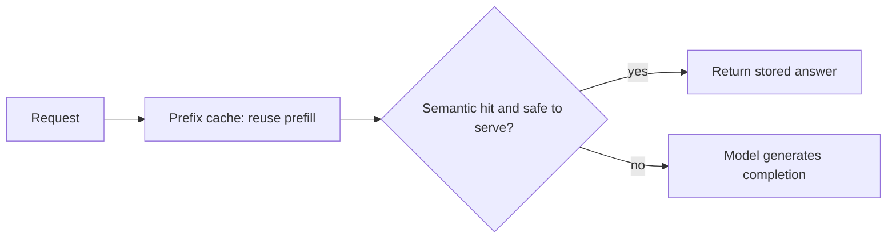

# Prompt vs. semantic caching — architecture, tradeoffs, and reviewing a design

You already know the two caches apart: prefix (prompt) caching reuses **prefill compute** on identical
leading tokens, and semantic caching returns a **stored response** on an embedding-similarity match.
This lesson zooms out to the **design space** — the levers you actually pull when you put a caching
layer in front of an LLM, what each one trades away, and how to judge someone else's caching design
the way an interviewer or a staff engineer in a design review would.

## The prompt-vs-semantic-caching design space

Every caching decision is really a decision about **how much work you skip versus how much correctness
risk you take on**. The two caches sit at opposite ends of that spectrum, and a real system layers
them. There are a handful of independent levers:

- **Which cache (or both).** A **prefix cache** is correctness-safe — it can only ever reuse compute
  for byte-identical leading tokens, so it never returns a wrong answer. A **semantic cache** returns a
  stored response on an *approximate* match, so it saves the whole generation but can be wrong. The
  SOTA shape is **layered**: an exact leading-token prefix cache in front of an embedding-similarity
  semantic cache, with guards on what the semantic layer is allowed to serve.
- **Prompt structure.** Prefix hits depend entirely on token layout: a **stable prefix** (system
  prompt, instructions, tool definitions, few-shot examples) first, the **variable suffix** (the user's
  input) last. This is a serving-time lever you fully control, and it is free.
- **Similarity threshold.** The single knob on the semantic layer. Low (permissive) buys hit rate but
  invites **false-positive hits**; high (strict) is safe but collapses savings. It is a
  savings-vs-correctness dial, not a "set once" constant.
- **Cache keys and scope.** Whether entries are **per-tenant / per-user** or global. Global semantic
  keys leak one user's cached answer to another — a correctness *and* privacy failure.
- **Invalidation and staleness.** A **TTL** and an invalidation story bound how stale a stored answer
  can get. Prefix caches self-limit (they only reuse compute), but a semantic cache holds *answers*
  that can go out of date.
- **Verification.** A lightweight check before trusting a semantic hit — turning a blind return into a
  guarded one.

## A tradeoff table for prompt-vs-semantic-caching

| Strategy | Buys you | Costs you | Reach for it when |
|---|---|---|---|
| Prefix (prompt) cache only | Prefill savings with zero correctness risk; model still generates | No full-call savings; needs stable prompt structure | Any deployment with a shared system prompt / few-shot preamble |
| Semantic cache only | Skips the whole generation — the biggest possible win | False-positive risk; stale answers; needs eval | Repeated, stable, low-personalization FAQ-style queries |
| Layered (prefix → semantic) | Compute savings everywhere plus full-call savings where safe | Two systems to key, invalidate, and monitor | Production traffic mixing shared prefixes and repeat questions |
| Conservative threshold + verification | Caps false positives while keeping some hits | Lower hit rate; extra verify step per hit | Higher-stakes answers where a near-miss is costly |
| Per-tenant / per-user keys + TTL | No cross-user leakage; bounded staleness | Lower reuse across users; cache churn | Multi-tenant or personalized responses |

The table is the interview answer in miniature: **name the lever, name what it costs, name the regime
where it wins.** A candidate who says "just add a semantic cache" without naming the false-positive
risk, the threshold tradeoff, and the eval they'd run is signalling shallow depth.

## Common, SOTA, and antipattern

A useful way to hold any subsystem is the **common → SOTA → antipattern** ladder.

- **Common (works, ships everywhere):** structure the prompt as stable-prefix-then-variable-suffix and
  turn on **provider prefix caching** (Anthropic, OpenAI). This is pure compute savings with no
  correctness risk and is a perfectly good baseline for most apps.
- **SOTA (frontier, worth reaching for under real pressure):** **layered caching** — the exact-prefix
  cache for compute, plus an embedding-similarity semantic cache (the **GPTCache** pattern, backed by
  Redis / a vector store) applied *only* where a slightly-off answer is acceptable, gated by a
  **conservative threshold**, **per-tenant keys**, a **TTL**, and a **cache-correctness eval** that
  measures how often a "hit" was actually the right answer. The frontier is treating cache correctness
  as a measured quantity, not an assumption.
- **Antipattern (looks fine, fails in production):** a **semantic cache on high-stakes or personalized
  answers**, where a close-but-wrong hit ships a confident wrong answer; **reordering the prompt** (or
  injecting a timestamp / request ID at the top) so prefix hits silently drop to zero; **tenant-blind
  keys** that serve one user's answer to another; and shipping a semantic layer with **no
  cache-correctness eval**, so false positives are invisible until a user complains. Each passes a demo
  and degrades or leaks under real traffic.

## Scaling, performance, and the token budget

The numbers that make this concrete:

- **Prefix savings scale with prefix length and reuse.** If 1,000 requests share a 2,000-token system
  prompt, naive serving pays 2,000 tokens of **prefill** a thousand times; a prefix cache pays it once
  and only computes each request's short variable tail. The longer and more stable the shared prefix,
  the larger the saving — but the win is **prefill only**; the model still decodes every completion.
- **Semantic savings are all-or-nothing per hit.** A semantic hit skips **prefill *and* decode** — the
  full generation — so its per-hit saving dwarfs a prefix hit. But that saving only materializes at the
  cache's **hit rate**, which the threshold controls, and every hit carries the false-positive risk.
- **The threshold trades savings against wrong answers, roughly monotonically.** Loosening it raises
  hit rate *and* false positives together; tightening it does the reverse. There is no free lunch — you
  pick the operating point with an eval, not a guess, because a short smoke test won't surface the
  wrong-but-close matches that only appear across a realistic query mix.
- **Layering compounds the wins.** The prefix cache clips compute on *every* request cheaply and
  safely; the semantic cache clips whole calls on the *repeat* subset where it's safe. They stack
  because they hit under different conditions and save different work.

## Reviewing a prompt-vs-semantic-caching design

When you are handed a caching design to critique — in a review or an interview — walk the same
checklist:

1. **Which cache is doing what?** If the design conflates "we added caching" into one bucket, stop
   there; prefix and semantic have different hit conditions, savings, and risks.
2. **Is the prompt structured for prefix hits?** Stable prefix first, variable suffix last. A timestamp
   or request ID at the top, or reordered few-shot examples, is an immediate flag — hit rate is near
   zero for a reason.
3. **What threshold, and how was it chosen?** A semantic threshold with no eval behind it, or "we tuned
   it on a few prompts," is the classic antipattern; require a **cache-correctness eval**.
4. **Where is the semantic cache allowed to serve?** High-stakes or personalized answers behind a
   semantic cache is a red flag. Safe territory is repeated, stable, low-personalization queries.
5. **Keys, TTL, and verification?** Per-tenant / per-user keys (no cross-user leakage), a TTL to bound
   staleness, and a verification step before trusting a hit. "It just works" is not a pressure policy.

Rating a design as **toy / prototype / demo-ready / production-ready** comes down to how many of these
it answers. A **toy** just calls the model with no caching. A **prototype** turns on prefix caching via
prompt structure. A **demo-ready** design adds a semantic layer with a threshold. A
**production-ready** design also scopes semantic caching to safe queries, uses per-tenant keys and a
TTL, verifies hits, and gates any threshold change behind a cache-correctness eval.

**Why it matters.** Reviewing a design is the senior version of the whole topic: naming which lever
does what, what it costs, and where it wins is exactly what separates "we added caching" from a system
you can trust under real traffic.
