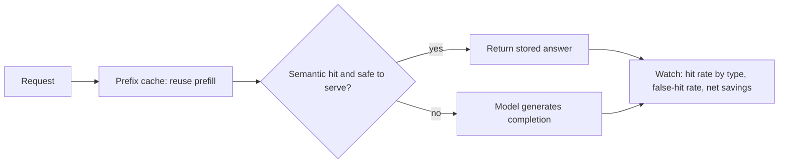

# Prompt vs. semantic caching — design & operations roadmap

## Roadmap: tradeoffs, review & production ops

**What this section covers.** Zooming out from the two caches to the **design space** — the levers you
pull when you layer them, how to review someone else's caching design, and the signals you watch once
it is running in production.

**The ideas you'll meet:**

- **Layered caching** — the SOTA shape: an exact-prefix cache in front of a guarded embedding-similarity semantic cache, each hitting under different conditions.
- **Tradeoff table / design levers** — naming, for each lever, what it buys, what it costs, and the regime where it wins.
- **Common → SOTA → antipattern** — the ladder for holding any subsystem, from a safe baseline to the frontier to the failure modes.
- **Cache-correctness eval** — measuring how often a served hit was actually the right answer, and gating threshold changes behind it.
- **Invalidation beyond TTL** — the frontier problem: embedding drift and content changing under a still-similar query, which crude time-based expiry can't catch.
- **Operational signals** — hit rate broken out by type, the false-hit / incorrect-serve rate, and cost/latency saved *net* of the cache's own overhead.
- **Canon & interview tells** — GPTCache and provider prefix caching as the prior art, and the red flags that sink a caching interview.

**Why it matters.** Real systems layer both caches, so the senior skill is not picking one but judging
the whole design — and knowing which number tells you the risky layer is quietly shipping wrong answers.
