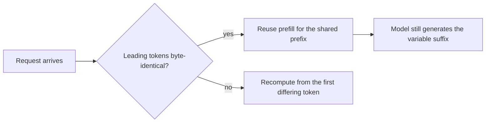

# Prompt vs. semantic caching — prefix-caching roadmap

## Roadmap: prefix (prompt) caching

**What this section covers.** The first of the two caches people put in front of an LLM: **prefix
(prompt) caching**, which reuses already-computed attention for *identical leading tokens* — and how
you structure a prompt so those hits actually land.

**The ideas you'll meet:**

- **Prefix (prompt) caching** — reuses the model's computed attention state for identical *leading* tokens; the cache hits only on an **exact-prefix match**.
- **Prefill** — the compute a prefix hit saves; the model still decodes a fresh completion for the variable tail.
- **Semantic caching** — the *other* cache, introduced here as the contrast: it matches on *meaning*, not identical tokens (the focus of the next section).
- **Stable prefix + variable suffix** — the prompt shape that maximizes hits: system prompt, instructions, tools, and few-shot examples first; the user's changing input last.
- **Prefix antipatterns** — a timestamp or request ID at the top, or reordered few-shot examples, that perturb the leading tokens and silently drop hit rate to zero.

**Why it matters.** Prefix caching is the correctness-safe, free win — it can never return a wrong
answer — so getting prompt structure right is the cheapest speedup you control before any riskier cache
enters the picture.
