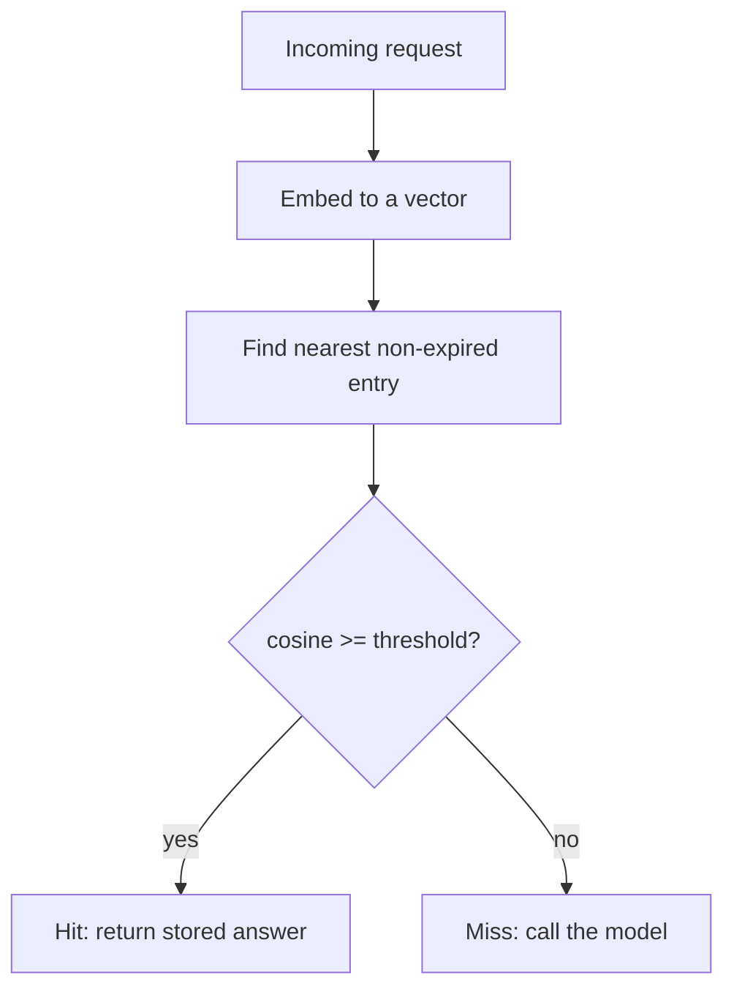

# Prompt vs. semantic caching — semantic-caching roadmap

## Roadmap: semantic caching

**What this section covers.** The second cache: **semantic caching**, which embeds a request and
returns a stored answer when a past request is *close enough* — skipping the model entirely — and the
one knob (the **threshold**) that trades savings against wrong answers.

**The ideas you'll meet:**

- **Semantic caching** — embed the request, look it up by similarity, and return a stored response without calling the model; it saves the *whole* generation.
- **Cosine similarity** — the normalized dot product used to measure how close two embeddings are; the metric behind "close enough."
- **Similarity threshold** — the single dial: too low invites wrong matches, too high collapses the hit rate.
- **False-positive hit** — the failure mode unique to semantic caching: a genuinely different question matches and a confident *wrong* answer ships.
- **TTL / staleness** — an expiry that turns an over-old entry into a miss so a stored answer can't go stale.
- **Per-tenant keys & verification** — scoping and a lightweight check that keep an approximate match from leaking or misfiring.

**Why it matters.** Semantic caching is the biggest possible saving *and* the biggest risk — it never
re-runs the model — so knowing where it is safe to serve, and where a near-miss is dangerous, is the
whole judgment the topic turns on.
