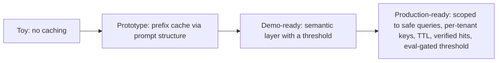

## Reviewing a caching design

**In brief.** Every caching decision trades how much work you skip against how much correctness risk
you take on. Reviewing one — in a PR or an interview — means naming which lever does what, what it
costs, and the regime where it wins, instead of collapsing everything into "we added caching."

**The levers.**

- **Which cache (or both)** — a prefix cache is correctness-safe: it only ever reuses prefill for byte-identical leading tokens, so it cannot return a wrong answer. A semantic cache returns a stored response on an approximate match, saving the whole generation but able to be wrong. The SOTA shape is **layered**: an exact-prefix cache in front of a guarded semantic layer.
- **Prompt structure** — the free serving-time lever for prefix hits: stable prefix (system prompt, instructions, tool definitions, few-shot examples) first, variable suffix (the user's input) last. Prefix matching starts at the first token and stops at the first difference, so a timestamp or request ID prepended **above** the system prompt changes the leading tokens on every call and drives hit rate to near zero — however long the shared prompt is. The fix is prompt structure: move all per-request variability to the end. Not the semantic threshold (that is a different cache, with a different hit condition), and not a shorter system prompt.
- **Similarity threshold** — the single knob on the semantic layer, and roughly monotonic: loosening it raises hit rate **and** false positives together; tightening it does the reverse. There is no free lunch, so the operating point is picked with an eval, not a guess.
- **Cache keys and scope** — per-tenant or per-user keys versus global. Tenant-blind semantic keys serve one user's cached answer to another: a correctness failure and a privacy failure.
- **Invalidation and staleness** — a TTL bounds how out of date a stored answer can get. Prefix caches self-limit because they only reuse compute; a semantic cache holds **answers**, which go out of date.
- **Verification** — a lightweight check before trusting a semantic hit, turning a blind return into a guarded one.

**Where the semantic layer may serve.**

- **Safe territory** — repeated, stable, low-personalization queries: FAQ-style questions whose answer is the same for everyone and rarely changes.
- **Red-flag territory** — high-stakes or highly personalized answers, where a near-miss returns a plausible-but-wrong response tailored to the wrong context. The remedy is **scope**, not a bigger embedding model: keep the high-stakes decision on a live model call and leave the semantic layer on the safe, repeated subset.
- **A threshold with no eval behind it** — "the answers looked fine on the ten prompts I tried" is exactly where wrong-but-close matches hide, because a short smoke test never surfaces them across a realistic query mix. Require a **cache-correctness eval** — how often was a served hit actually the right answer — as the gate on any threshold change. The answer is never to ban low thresholds; it is to measure the operating point.

**The review checklist.**

- Which cache is doing what, or does the design conflate two different hit conditions, savings, and risks into one bucket?
- Is the prompt structured for prefix hits — stable prefix first, every source of per-request variation at the end?
- What threshold, and how was it chosen — an eval over a realistic query mix, or a handful of prompts?
- Where is the semantic cache allowed to serve, and is anything high-stakes or personalized sitting behind it?
- Keys, TTL, and verification — or is "it just works" the pressure policy?

**Why it matters.** These checks place any caching design on the toy → prototype → demo-ready →
production-ready ladder in minutes, and they name the antipatterns that sink a review: a semantic
cache on high-stakes or personalized answers, top-of-prompt variability that silently kills prefix
hits, tenant-blind keys, and a semantic layer shipped with no cache-correctness eval.
