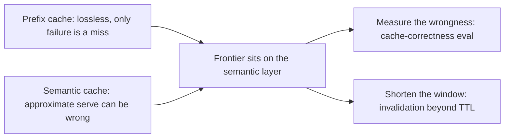

## The frontier & operating a live cache

**In brief.** One cache is lossless and the other is risky, and the frontier lives almost entirely on
the risky side. The research edge and the production dashboard attack the same weakness from two
angles: a semantic hit can be wrong and you will not know.

**Where the frontier is.**

- **Lossless versus risky** — a provider prefix cache (Anthropic, OpenAI) reuses prefill for byte-identical leading tokens, so a hit returns the **same** computation the model would have produced anyway; its only failure mode is a **miss**, never a wrong answer. There is real engineering there — prefix minimums, cache-write versus cache-read pricing, provider cache lifetimes — but nothing that can corrupt a result, which is why frontier attention is elsewhere. The semantic cache (the **GPTCache** pattern, Zilliz 2023) returns a stored response on an approximate embedding match, so every frontier item — safe thresholds, correctness evals, invalidation — exists to make that approximate serve safe.
- **Cache correctness as a measured quantity** — the load-bearing frontier idea: stop **assuming** a hit was right and start **measuring** it. A cache-correctness eval over a realistic query mix answers "how often was a served hit actually the right response?" and becomes the gate on any threshold change. A false-positive hit is a **silent regression** — invisible until a user complains — so cache correctness is treated like any other eval: a gate, not a vibe. A spot check on a handful of prompts is precisely where the wrong-but-close matches slip through, and correctness cannot be proved once at design time and then assumed.
- **Invalidation beyond TTL** — a TTL keys on **time passing**, and expiry only turns a hit into a miss; but "how long is this answer still true?" is a per-query property, not one global constant. The open problem is invalidation that keys on **meaning changing**: **embedding drift** (the embedding model or index shifts under stored entries), content that changed under a **still-similar** query, and provider prefix-cache lifetimes you do not control. Crude time-based expiry detects none of these — which is why the layered exact-prefix-in-front-of-a-guarded-semantic shape endures.

Both open problems attack the same weakness from two sides: **measure the wrongness**
(cache-correctness eval) and **shorten the window it can persist** (invalidation beyond TTL).

**Signals to watch in production.**

- **Hit rate, broken out by type** — never one blended number. A near-zero **prefix** hit rate on a shared system prompt means per-request variability leaked to the top of the prompt. **Semantic** hit rate says how much whole-generation saving you are capturing, but it moves with the threshold, so it only means something read next to the false-hit rate.
- **False-hit / incorrect-serve rate** — the fraction of served semantic hits that were actually wrong for the request. This is the only correctness signal (the prefix layer cannot produce one) and the live form of the cache-correctness eval. A loosened threshold inflates it silently and a demo will never show it, so a rise there is a **correctness incident, not a cost one** — the thing to alert on. Prefix hit rate, embedding-service utilization, and vector-store entry count say nothing about whether a served hit was right.
- **Staleness / TTL-miss rate** — how often served content was out of date, and how often expiry turned a would-be hit into a miss. A high TTL-miss rate means expiry is too aggressive and you are paying for regeneration you did not need; rising staleness complaints at a long TTL mean the opposite.
- **Cost and latency saved, net of the cache's own overhead** — the semantic layer pays an **embedding plus vector-search tax on every request, hit or miss**. At a low hit rate that per-request tax can eat most of the whole-generation saving, so a dashboard reporting a large **gross** saving can sit alongside a total endpoint cost that barely moved. Report savings **net**, and raise the hit rate or scope the layer so the tax is worth paying.

**Why it matters.** Alert on the false-hit / incorrect-serve rate, read hit rate by type to know which
layer is actually working, and never quote the gross number a hit-rate dashboard shows — the figure
that matters is what the cache saves after its own overhead.
