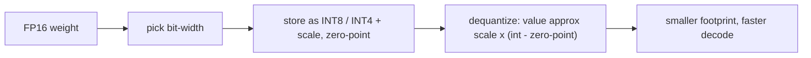

# Quantization — numeric formats and footprint roadmap

## Roadmap: numeric formats and footprint

**What this section covers.** How a model's numbers get stored in fewer bits than they were trained
in — the numeric formats (FP16, BF16, FP8, INT8, INT4), the footprint and bandwidth that buys back,
and the scale, zero-point, and granularity that map low-bit integers back to real values.

**The ideas you'll meet:**

- **Quantization** — storing each weight in fewer bits than the training format, keeping the same parameter count.
- **Footprint and bandwidth** — the memory and memory-bandwidth cost that fewer bits cut, which is why decode speeds up.
- **Bit-width** — FP16 to INT8 (~2x) to INT4 (~4x): fewer bits, less memory, more error.
- **FP16 / BF16 / FP8** — float formats that spend their bits differently on precision versus dynamic range.
- **Scale and zero-point** — the float multiplier and integer offset that map an integer code back to an approximate real value.
- **Granularity** — per-tensor versus per-channel scales; finer scales rescue outlier-heavy channels.
- **Clamp** — bounding a code to the integer range so a stray value never overflows and corrupts the tensor.

**Why it matters.** The format and granularity you pick set the floor on both how small the model gets
and how much quality survives — every later section builds on these mechanics.
