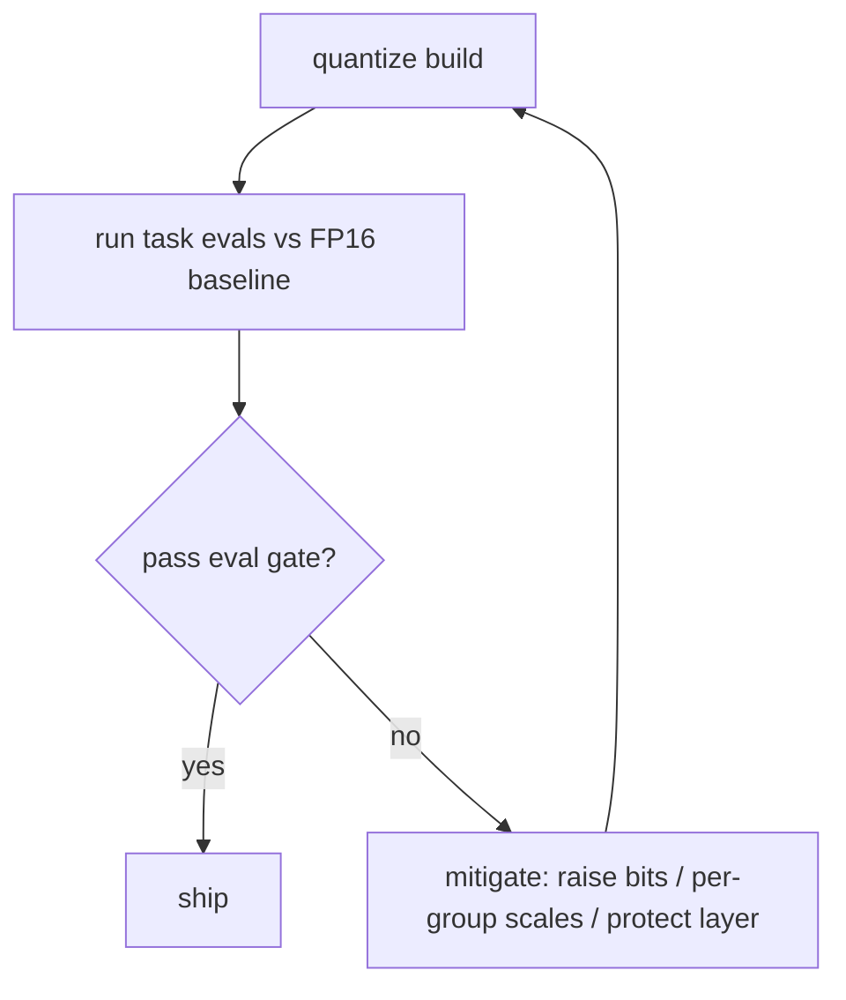

# Quantization — frontier and production operations roadmap

## Roadmap: frontier and production operations

**What this section covers.** Where quantization research is still moving — sub-4-bit, FP8, and
activation quantization — and the handful of signals you actually watch when a quantized model is live
in production.

**The ideas you'll meet:**

- **Sub-4-bit and FP8** — the push below INT4 and toward an 8-bit float range that suits activation outliers.
- **Activation quantization** — the hard frontier boundary; SmoothQuant moves the difficulty, but INT4 activations leave nowhere to move it.
- **Low-bit quality prediction** — the open problem of knowing in advance whether a bit-width holds quality before spending the compute.
- **Perplexity versus task-eval gap** — a flat perplexity with a large task-eval drop is the expected signature of low-bit damage.
- **Per-task quality delta** — measure each task against the FP16 baseline, not one aggregate, to locate what to protect.
- **Eval gate** — the CI discipline: a quantized build must pass the real task suite against the baseline before it ships.

**Why it matters.** This is what separates someone who knows quantization from someone who ships it:
gate on the per-task eval delta against the FP16 baseline, and never let a flat perplexity number stand
in for quality.
