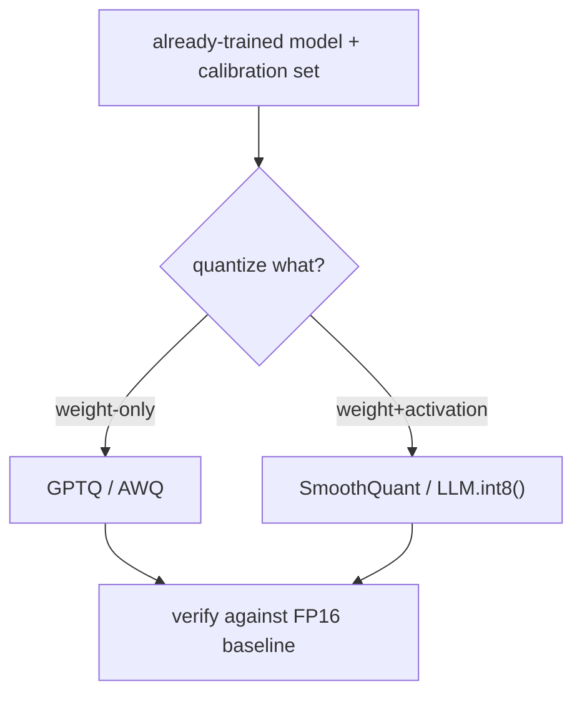

# Quantization — methods roadmap

## Roadmap: quantization methods

**What this section covers.** The post-training methods that let a low-bit model stay close to its
FP16 original — GPTQ, AWQ, and SmoothQuant — plus the tradeoff levers and quality checks a systems
engineer weighs when reviewing a quantization design.

**The ideas you'll meet:**

- **Post-training quantization (PTQ)** — quantizing an already-trained model with a small calibration set, no retraining.
- **GPTQ** — layerwise, Hessian-guided reconstruction that holds up even at INT4.
- **AWQ** — activation-aware weight quantization that protects the salient channels tied to large activations.
- **SmoothQuant** — migrates activation-outlier difficulty into the weights so INT8 activations become feasible.
- **LLM.int8()** — keeps a few outlier features in higher precision while running the rest in INT8.
- **The tradeoff levers** — bit-width, what you quantize, method, granularity, and verification.
- **Perplexity versus task evals** — why a smooth average can stay flat while reasoning, code, and long-context quality drop.

**Why it matters.** The method is what turns "fewer bits" into "still accurate"; naming the lever, its
cost, and the regime where it wins is exactly what separates a shallow plan from a production-ready one.
