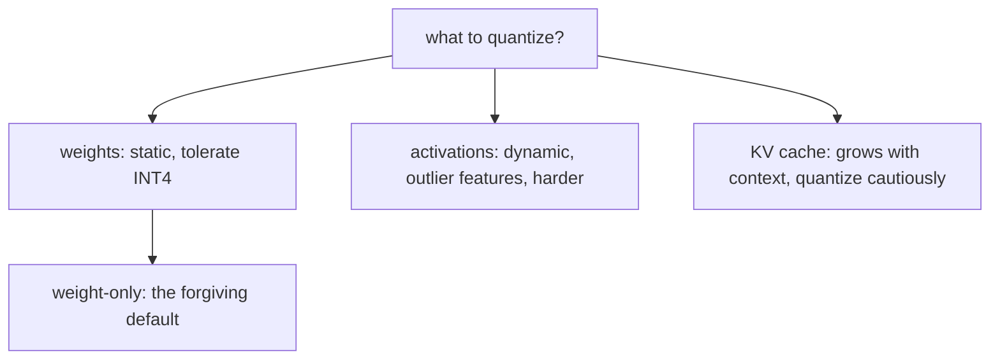

# Quantization — what to quantize roadmap

## Roadmap: what to quantize

**What this section covers.** Not everything in a model is equally safe to shrink. This section
separates the three things you can quantize — weights, activations, and the KV cache — and why each
carries a different quality risk.

**The ideas you'll meet:**

- **Weights** — static parameters fixed after training; they tolerate low bit-width well.
- **Activations** — dynamic, per-input values that carry outlier features, which makes them the harder target.
- **Outlier features** — a handful of huge-magnitude channels that a fixed low-bit range cannot hold without crushing everything else.
- **Weight-only quantization** — INT4 weights with higher-precision activations; the safe default that captures most of the bandwidth win.
- **Weight+activation quantization** — shrinks activations too, but only survives with outlier handling.
- **KV cache** — cached keys and values that can exceed the weights at long context; INT8/FP8 KV buys longer contexts at some quality cost.

**Why it matters.** Choosing what to quantize is the first real quality decision — weight-only is
forgiving, while activations and the KV cache are where aggressive low-bit precision quietly hurts.
