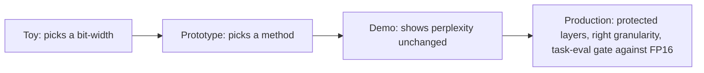

## Reviewing a quantization design

**In brief.** Every quantization decision is really one trade: how much footprint and bandwidth you buy
back against how much task quality you risk. Reviewing a plan — in a design review or an interview —
means walking five largely independent levers and refusing to accept "we quantized it to INT4" as an
answer.

**The five levers.**

- **Bit-width** — FP16 to INT8 is about 2x weight memory, FP16 to INT4 about 4x, before the small
  scale and zero-point overhead. Because autoregressive decode is dominated by **streaming weights out
  of memory**, that footprint cut usually shows up as throughput and latency, not just capacity. Error
  grows as bits shrink, and low-bit hurts the hardest capabilities first.
- **What you quantize** — weights only, weights and activations, or the KV cache. Weights are **static**
  and tolerate INT4 well; **activations are dynamic**, computed per input, and carry large **outlier
  features** that a fixed low-bit range cannot represent without crushing everything else; the KV cache
  trades long-context quality for capacity. **Weight-only INT4 is the forgiving default**: decode is
  weight-streaming-bound, so smaller weights capture most of the win, while activations stay in higher
  precision and the outlier problem is sidestepped entirely. Its cost is honest — activations stay
  FP16, so the total saving is less than the weight ratio suggests.
- **Method** — round-to-nearest, versus **GPTQ** (Hessian-guided layerwise reconstruction), **AWQ**
  (protect the salient channels tied to large activations), **SmoothQuant** (migrate activation outliers
  into the weights so INT8 activations survive), or **LLM.int8()** (keep outlier features in higher
  precision). The method is what keeps a 4x-smaller model close to the FP16 baseline; round-to-nearest
  near INT4 is the weakest option, not the strongest.
- **Granularity** — per-tensor is cheapest, but a **single wide-ranging channel forces a coarse scale on
  everything**. Per-channel or per-group scales cost metadata and kernel complexity but rescue the
  well-behaved channels from the outliers — the first fix to reach for near INT4, before spending more
  bits.
- **Verification** — a perplexity smoke test versus real task evals against the FP16 baseline. This is a
  lever because how you measure decides which silent regressions you ship.

**The review checklist.**

- **What is quantized, to how many bits?** Weight and activation INT4 with a single per-tensor scale, no
  outlier handling, is an immediate flag — it is the naive-activation-quant antipattern, and quality
  collapses. The fix is to migrate the outliers with SmoothQuant, keep them in higher precision with
  LLM.int8(), or step back to a higher bit-width and per-channel scales. Weights are not the problem
  there; INT4 weights are the part that works.
- **Which method and granularity?** A real plan names GPTQ or AWQ, adds SmoothQuant or LLM.int8() if
  activations are in scope, and uses per-channel or per-group scales.
- **Which layers are protected?** Blindly quantizing sensitive or outlier-heavy layers is a red flag.
- **How is quality verified?** "Perplexity barely moved" is not verification.
- **What is the mitigation if it regresses?** A real design names its escape hatch: raise the bit-width,
  switch to per-group scales, protect the sensitive layer, or fall back from weight-and-activation to
  weight-only.

**Why it matters.** These five checks place any plan on the toy to prototype to demo-ready to
production-ready ladder in minutes, and they name the antipatterns that sink a candidate: per-tensor
round-to-nearest at INT4, naive activation quantization with no outlier handling, INT4 on
reasoning-heavy tasks unchecked, and shipping because perplexity barely moved.
