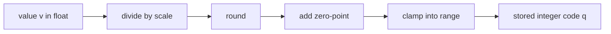

## Inside the formats: bit budgets and the integer mapping

**In brief.** Naming FP16, BF16, FP8, INT8 and INT4 is the easy half. One level down there are only two
questions: where a float format spends its bits — precision versus dynamic range — and how an integer
code is actually mapped back to a real value. That arithmetic is what decides how much error you pay,
and which format survives outliers.

**The bit budget.**

- **FP16** — 16-bit float: 1 sign, 5 exponent, 10 mantissa bits. Good precision, but a narrow dynamic
  range that can overflow or underflow.
- **BF16** — the same 16 bits, split differently. It keeps FP32's **8-bit exponent**, so it has a wide
  dynamic range, and pays for it with fewer mantissa bits. BF16 trades **mantissa precision for range**,
  which is why it resists overflow in training; FP16 makes the opposite trade. Same total width — only
  the split differs.
- **FP8** — 8-bit float, e.g. the E4M3 and E5M2 variants. Floating point spends bits on **range**, which
  is exactly what activation **outlier features** stress, so FP8 tolerates activations more gracefully
  than the uniform levels of INT8. That is why it is the activation-friendly 8-bit target for weights
  **and** activations on capable hardware. It is not lossless, and it still needs a real task eval.
- **INT8 and INT4** — integers have no exponent and give uniform levels, so the tensor's whole dynamic
  range has to be carried by the scale instead of by the format.

**The integer mapping.**

- **scale** — for per-tensor `uint8`, `scale = (max − min) / 255`: the size of **one quantization step**,
  the gap between adjacent codes. The value range is spread over 255 gaps, so the step is the range
  divided by 255 — not the range itself, and not its reciprocal.
- **zero-point** — the integer code that represents `0.0`, computed as `round(−min / scale)` and clamped
  into range.
- **quantize and dequantize** — `q = clamp(round(v / scale) + zeroPoint, 0, 255)` and
  `v ≈ (q − zeroPoint) × scale`.
- **rounding error** — snapping each value to the nearest of 256 levels costs at most about **half a
  step**, on the order of `scale`. That is the quality traded for the smaller weights.
- **clamp** — a value that rounds to a code outside the representable range must be bounded. An
  unclamped code **overflows and wraps**, silently corrupting the tensor. Clamping is a correctness
  guard: it does not add levels, remove the need for a zero-point, or make quantization faster.
- **constant-tensor guard** — if `max` equals `min` the range is zero and `scale` would be zero, a divide
  by zero; handle it, for example with `scale = 1`, so a constant tensor reconstructs exactly instead of
  producing `NaN`.

**Why it matters.** The format's bit split explains why BF16 survives training and why FP8 is the
activation-friendly 8-bit, and the scale-round-clamp pipeline explains where every integer quantization
bug and every unit of error actually comes from.
