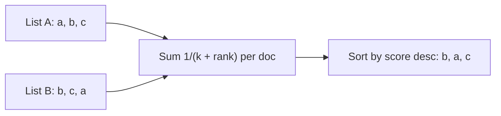

# Build it: reciprocal rank fusion

## Why fuse and how RRF works

Hybrid retrieval runs more than one retriever — typically a **dense** (vector) search and a **sparse**
(BM25) search — and each returns its own ranked list. Their scores live on completely different
scales, so you can't just add them. **Reciprocal Rank Fusion (RRF)** solves this by throwing away the
raw scores and combining *ranks* instead.

For each document, sum a small contribution from every list it appears in:

`score(d) = Σ over lists  1 / (k + rank(d))`

where `rank(d)` is the document's **1-based** position in that list and `k` is a constant (commonly
`60`). A document missing from a list simply contributes nothing from that list. You then sort all
documents by `score` descending.

Worked example — two lists, `k = 60`:
- list A = `[a, b, c]`, list B = `[b, c, a]`
- `score(a) = 1/(60+1) + 1/(60+3) ≈ 0.03227`
- `score(b) = 1/(60+2) + 1/(60+1) ≈ 0.03252`
- `score(c) = 1/(60+3) + 1/(60+2) ≈ 0.03200`
- Fused order: **`[b, a, c]`** — `b` wins because it's near the top of *both* lists.

## Details and tie-breaking

- **What `k` does:** the `+k` in the denominator flattens the curve so a single first-place finish
  can't dominate; a larger `k` weights deep ranks more evenly. It's what lets one list's rank-1 not
  swamp another list's rank-2.
- **Coverage reward:** an item that several retrievers rank — even if none ranks it first — accumulates
  score from each, which is exactly the "agreement" signal hybrid search wants.
- **No normalization:** RRF never touches the raw dense/sparse scores, so you avoid the fragile job of
  normalizing incomparable score distributions. That simplicity is its main appeal.
- **Determinism:** when two documents tie on score, break the tie by **id ascending** so the fused
  ranking is reproducible (important for eval stability).

RRF matters because it makes hybrid search practical: it fuses incomparable dense and sparse rankings
with no score calibration, which is why it's the default recipe for combining retrievers.
