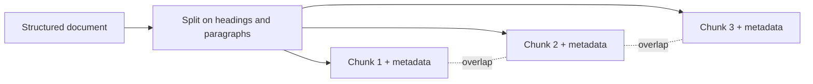

# RAG architecture — chunking

## The chunk-size tradeoff

Before anything is retrieved, the corpus must be split into **chunks** — the units that get embedded
and returned. Chunk size is a genuine tradeoff:

- **Large chunks** carry more surrounding context, but their single embedding vector has to average
  more content, which **dilutes precision** — the vector points at a blurry centroid of several ideas.
- **Small chunks** produce sharp, precise embeddings, but a fact can be **stranded** from the context
  that makes it meaningful.

There is no universally correct size; it depends on the corpus and the queries. But the *shape* of the
tradeoff is always the same: context versus precision.

## Chunking strategies and pitfalls

The classic **antipattern** is naive **fixed-size** splitting: cut every N characters. It slices
through the middle of sentences, tables, and code blocks, producing chunks that are incoherent on
their own.

Better strategies:

- **Structure-aware chunking** — split on document structure (headings, paragraphs, list items) so
  each chunk is a coherent unit.
- **Overlap** — duplicate a little text across adjacent chunks so a fact that straddles a boundary
  still appears intact in at least one chunk.
- **Metadata** — attach source, section, and timestamp to each chunk, enabling filtering and citation.

Structure-aware splitting with overlap keeps each chunk coherent while a boundary fact survives in an
adjacent chunk:

Get chunking wrong and no amount of clever retrieval or prompting downstream can recover the meaning
that was destroyed at split time.
