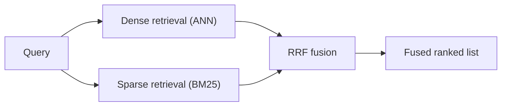
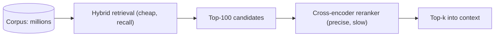

# RAG architecture — retrieval and reranking

## Dense, sparse, and hybrid search

There are two complementary ways to find relevant chunks:

- **Dense retrieval** compares the query's embedding to chunk embeddings (e.g. cosine similarity over
  vectors, served by an ANN index like HNSW). It captures **semantic** similarity — paraphrases and
  synonyms — even when no words overlap.
- **Sparse retrieval** like **BM25** matches lexical tokens. It shines on **exact keywords**, code
  identifiers, product codes, and rare terms — precisely the cases where dense vectors go fuzzy.

Because their strengths are complementary, **hybrid search** runs both and fuses the results.
**Reciprocal Rank Fusion (RRF)** is the common recipe: it combines the two ranked lists by each item's
**rank position** (summing 1/(k + rank)), sidestepping the fact that cosine scores and BM25 scores
live on incomparable scales.

## Reranking and the latency tradeoff

First-stage retrieval is optimized for **recall** — cast a wide net cheaply. A **cross-encoder
reranker** then improves **precision**: it reads the query and a candidate document *together* and
scores that pair jointly, which is far more accurate than comparing two independently-computed vectors.

The catch is **latency**. A cross-encoder is too slow to score the whole corpus for every query, so the
standard pattern is a funnel: retrieve a larger candidate set cheaply (say top-100 via hybrid search),
then rerank only that small set down to the top-k that go into context. You pay the reranker's cost on
a handful of documents, not the millions in your index.

This two-stage shape — cheap wide recall, then precise reranking — is why hybrid retrieval plus a
reranker is the production default: it buys precision where it counts without paying it on the whole corpus.
