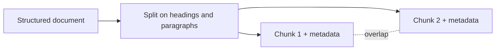

# RAG architecture — chunking roadmap

## Roadmap: chunking the corpus

**What this section covers.** The first upstream choice in the pipeline: how the corpus is split into
the units that get embedded and retrieved. You'll meet the core tradeoff of chunk size and the
strategies that keep each chunk a coherent, retrievable unit.

**The ideas you'll meet:**

- **Chunk** — the unit of text that gets embedded and returned; the atom of retrieval.
- **The chunk-size tradeoff** — large chunks carry context but dilute the embedding; small chunks are precise but can strand a fact from what explains it.
- **Fixed-size splitting (antipattern)** — cutting every N characters, slicing through sentences, tables, and code blocks.
- **Structure-aware chunking** — splitting on document structure (headings, paragraphs, list items) so each chunk is coherent.
- **Overlap** — duplicating a little text across adjacent chunks so a boundary-straddling fact survives intact.
- **Metadata** — attaching source, section, and timestamp to each chunk for filtering and citation.

**Why it matters.** Get chunking wrong and no amount of clever retrieval or prompting downstream can
recover meaning destroyed at split time — it sets the ceiling on the whole system's retrieval quality.
