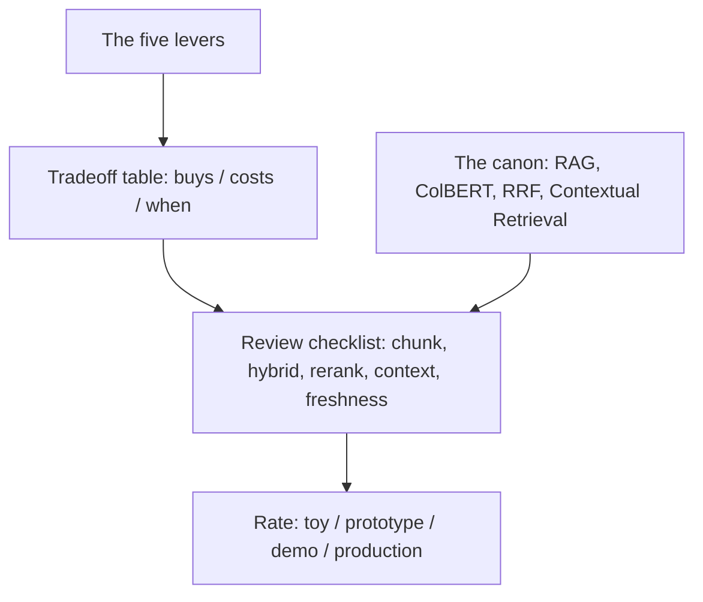

# RAG architecture — design-review roadmap

## Roadmap: reviewing a RAG design

**What this section covers.** How to zoom out from the individual pieces to the whole design space — the
levers a retrieval engineer pulls, what each trades away, and how to critique someone else's RAG design
the way an interviewer or a staff engineer in a review would, backed by the field's canon.

**The ideas you'll meet:**

- **The five levers** — chunking, retrieval method, reranking, context enrichment, and freshness — the roughly independent dials of any RAG design.
- **The tradeoff table** — for each lever: what it buys you, what it costs, and the regime where it wins.
- **The common → SOTA → antipattern ladder** — a way to hold any subsystem: the shipping baseline, the frontier worth reaching for, and the thing that fails quietly in production.
- **The review checklist** — chunking, dense-vs-hybrid, reranker + candidate-set size, context assembly, and freshness.
- **The canon** — RAG (Lewis et al.), ColBERT (late interaction), RRF (Cormack), and Contextual Retrieval, named as prior art.
- **Interview red flags** — fixed-size naive chunking, dense-only retrieval, no reranker, and a stale index.

**Why it matters.** Naming the levers, defending each choice, and citing the canon is exactly what reads
as senior in a design review or interview — shallow answers stop at "just use embeddings and top-k."
