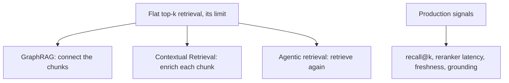

# RAG architecture — frontier-and-ops roadmap

## Roadmap: frontier and operations

**What this section covers.** The two things that separate someone who *knows* RAG from someone who
*runs* it: the current research edge that pushes past flat top-k retrieval, and the operational signals
you watch once the system is live.

**The ideas you'll meet:**

- **GraphRAG / retrieval-for-reasoning** — structured multi-hop retrieval over a graph of entities and relations, for answers that live in the *connections* between passages.
- **Contextual Retrieval** — prepending a chunk-situating summary before embedding, at one LLM call per chunk at index time.
- **Agentic / iterative retrieval** — looping to rewrite the query, retrieve, inspect, and retrieve again instead of a one-shot lookup.
- **recall@k in production** — is the relevant passage actually landing in the top-k the generator sees? The leading indicator of retrieval regressions.
- **Reranker latency** — the slow stage; its p95 scales with candidate-set size, not corpus size.
- **Index freshness / staleness** — how far behind the live corpus the index has fallen; stale indexes serve confidently wrong answers no model eval catches.
- **Grounding / citation rate** — the share of answers actually supported by retrieved passages, used *alongside* recall@k to localize a bad answer to retrieval or generation.

**Why it matters.** GraphRAG, Contextual Retrieval, and agentic loops all attack the same limit of flat
top-k from different angles, and the production signals are how you tell a retrieval miss from a
generation failure instead of guessing from one end-to-end score.
