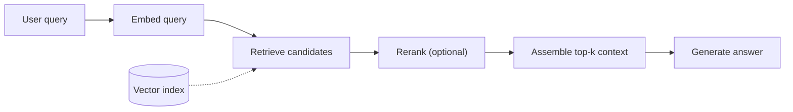

# RAG architecture — pipeline roadmap

## Roadmap: the RAG pipeline

**What this section covers.** What retrieval-augmented generation actually is, when to reach for it
(and when not to), and the fixed stages a query flows through — so you can see RAG as a *pipeline* whose
quality is set upstream, long before any prompt is written.

**The ideas you'll meet:**

- **Retrieval-augmented generation (RAG)** — fetching relevant documents at query time and putting them in context so the answer is grounded in *your* data, not the weights.
- **When to use RAG** — knowledge that is private, current/changing, or needs to be citable back to a source.
- **When *not* to use RAG** — when you need a *behavior* change (tone, skill, reasoning), which calls for fine-tuning or prompting, not a vector index.
- **The query-time pipeline** — the fixed stages: embed → retrieve → rerank → assemble → generate.
- **Offline vs online** — chunking and embedding happen offline into a shared index; the query path reads from it at run time.

**Why it matters.** Everything else in this topic — chunking, retrieval, reranking, review — is a choice
about one stage of this pipeline, so seeing the whole flow first is what makes those choices legible.
