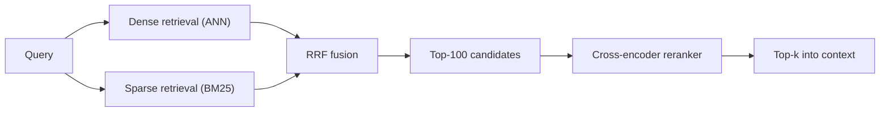

# RAG architecture — retrieval roadmap

## Roadmap: retrieval and reranking

**What this section covers.** The query-time engine of RAG: the two complementary ways to find relevant
chunks, how to fuse them, and how a second-stage reranker buys precision — including building the fusion
step yourself.

**The ideas you'll meet:**

- **Dense retrieval** — comparing query and chunk embeddings for *semantic* similarity, even with no word overlap.
- **Sparse retrieval (BM25)** — lexical token matching that shines on exact keywords, IDs, and rare terms.
- **Hybrid search** — running both and fusing the ranked lists to cover both regimes.
- **Reciprocal Rank Fusion (RRF)** — combining lists by rank position, summing `1/(k + rank)`, sidestepping incomparable raw scores.
- **The constant `k`** — the denominator term that flattens the curve so one first-place finish can't dominate.
- **Cross-encoder reranker** — scoring a query–document pair *jointly* for precision far beyond independent vectors.
- **The retrieve-then-rerank funnel** — recall cheaply to a wide candidate set, then rerank only that set down to top-k, so latency scales with candidates, not corpus.

**Why it matters.** Retrieval quality is where a RAG system lives or dies; hybrid + fusion + reranking is
the production default because each piece patches a failure the others miss.
