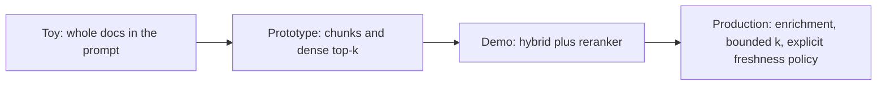

## Reviewing a RAG design

**In brief.** Every RAG decision is really a decision about **what lands in the model's context window,
how relevant it is, and how fresh and attributable it stays** — at a fixed latency and cost budget.
Reviewing a design means walking the five levers, naming what each one costs, and spotting the four
antipatterns that pass a demo and fail quietly on real traffic.

**The five levers.**

- **Chunking** — fixed-size character splits versus structure-aware splitting on headings, paragraphs, and tables, with small overlap and metadata. Chosen at index time and expensive to change later.
- **Retrieval method** — dense captures paraphrase and semantic similarity; sparse (BM25) catches exact keywords, identifiers, error codes, and rare terms; hybrid runs both and fuses the ranked lists with **RRF**, which combines by rank position rather than incomparable raw scores. Hybrid doubles index cost but de-risks recall: it is what stops an exact-identifier query from silently returning nothing — a failure dense-only hides until a user hits it. The fix for a dense-only design is sparse retrieval plus fusion, **not** a different distance metric or a bigger embedding model.
- **Reranking** — a cross-encoder jointly scores each query–document pair for precision a single-vector match cannot reach. It is accurate but slow, so it runs only over a bounded first-stage candidate set. Rerank cost scales with **candidate-set size, not corpus size**; widening the candidate set trades latency for recall.
- **Context enrichment** — plain chunks versus **Contextual Retrieval**, which prepends a chunk-situating summary before embedding so an isolated chunk still carries its document context.
- **Freshness** — re-index cadence, TTLs, and incremental updates. A throughput and cost tax you choose deliberately, spending the budget where the corpus actually changes.

**Context is a ranked budget, not a bucket.**

- You retrieve top-k chunks into a finite window, so **precision at small k matters more than raw recall**. Stuffing 50 mediocre chunks both dilutes the answer and burns tokens.
- A reranker that lifts the right 5 to the top of the window is worth more than a bigger k. Recall comes from a wide candidate set; precision comes from the reranker — passing the whole candidate set straight through skips the precision half.

**The four antipatterns.**

- **Naive fixed-size chunking** that severs sentences, tables, and code blocks.
- **Dense-only retrieval** that whiffs on exact IDs, flags, error codes, and rare terms — the classic flag on a corpus like developer docs.
- **No reranker**, so top-k is whatever the first stage happened to surface.
- **A stale index**, which serves confidently wrong answers that **no model-side eval will catch**. The retrieved documents are genuinely in the index but superseded, so the generator faithfully grounds on outdated text. That is a freshness failure — not a hallucination, not a chunk-size problem, and not something a reranker or a larger LLM detects. The fix is an explicit freshness policy.

**The review checklist.**

- How is the corpus chunked — structure-aware with overlap and metadata, or fixed-size character splits?
- Dense-only or hybrid, and does the corpus contain identifiers, codes, or rare terms?
- Is there a reranker, and over how many candidates? Too small a candidate set cannot recover recall the first stage dropped.
- How is context assembled and bounded — is k tuned, are chunks deduplicated, is anything done for context-poor chunks?
- How does the index stay fresh — a named re-index cadence or TTL, never "it just works"?

**Why it matters.** How many of these a design answers is exactly what places it on the toy →
prototype → demo → production ladder, and the value in a review or an interview is in naming the lever,
its cost, and the regime where it wins — not in reciting a single best stack.
