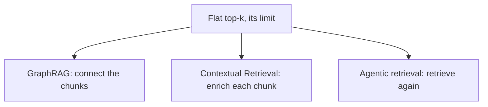

## The frontier & operating RAG in production

**In brief.** GraphRAG, Contextual Retrieval, and agentic loops all attack the **same** limitation of
flat top-k retrieval — that a single lookup often cannot assemble the answer — from three different
angles: **connect the chunks**, **enrich each chunk**, **retrieve again**. Once the system is live, a
handful of signals tell you whether a bad answer came from retrieval or from generation.

**Where the frontier is.**

- **GraphRAG / retrieval-for-reasoning** — replaces flat top-k with structured, **multi-hop retrieval over a graph** of entities and relations extracted from the corpus. It targets questions whose evidence **spans multiple documents and lives in the connections between passages**, so the answer is assembled rather than hoped for. The open question is when the structure earns its build-and-maintenance cost: a graph you extract and keep current is a recurring bill, so it wins on genuinely multi-hop, cross-document reasoning and is over-engineering on lookup-style queries.
- **Contextual Retrieval (Anthropic, 2024)** — the **index-time** frontier. It prepends a short document-situating summary to each chunk **before embedding**, so a fragment retrieves on its own meaning. The failure it fixes is chunks that lost their referents. It pays for that with **one LLM call per chunk at index time** — a cost spent once at build, not per query. It attacks chunking, not query-time ranking.
- **Agentic / iterative retrieval** — loops that **rewrite the query, retrieve, inspect, and retrieve again** instead of one-shot lookup. The distinguishing failure it targets is a hard query the first phrasing gets wrong, where one-shot dense or hybrid retrieval keeps missing. It buys recall on those queries and pays with **extra latency and more retrieval calls per answer**.
- **Freshness and eval fidelity at scale** — the field's own open problems. The hard part of graph and agentic retrieval is rarely demoing that they run; it is proving they beat plain hybrid plus rerank on a labelled set, and separating a retrieval miss from a grounding failure when they do not.

**Signals to watch in production.**

- **Retrieval hit rate / recall@k** — on real traffic, is the relevant passage actually landing in the top-k the generator sees? The **leading indicator** of a retrieval-side regression — a bad re-index, an embedding-model swap, drifting queries — visible before users complain. This is the signal that separates a retrieval miss from a generation problem.
- **Reranker latency** — the cross-encoder is the slow stage and its p95 scales with **candidate-set size, not corpus size**. Watch it alongside candidate-set width: a rerank latency creep is usually someone quietly enlarging k. This is the knob you alert on when TTFT drifts.
- **Index freshness / staleness** — re-index lag, TTL expiry, incremental-update backlog. **Invisible in generation-quality metrics**, because the model is faithfully grounding on out-of-date passages, so it must be monitored explicitly.
- **Grounding / citation rate** — the share of answers actually supported by the retrieved passages. Low grounding with **good** retrieval means the generator is going off-context: a faithfulness failure. **High** grounding alongside confidently wrong answers on recently-changed facts points at the retrieved content itself — stale index — not at the generator.

**Why it matters.** Alert on recall@k and reranker latency as the retrieval-regression leading
indicators, monitor freshness explicitly because model-side evals are blind to it, and read grounding
rate against recall@k to localize a bad answer — never reason about RAG quality from one end-to-end
score that hides which stage failed.
