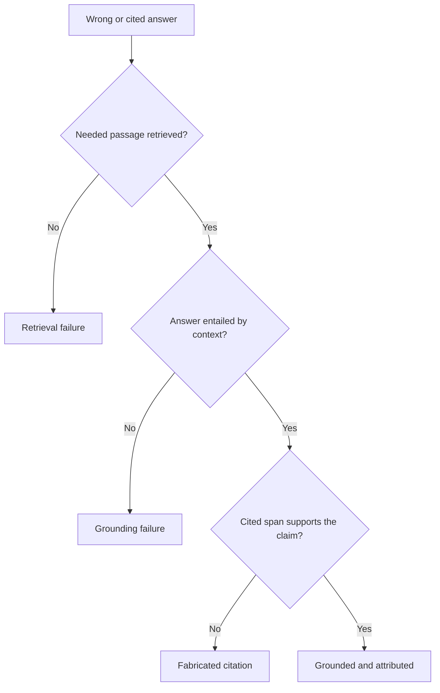

# Retrieval evals — grounding and attribution roadmap

## Roadmap: grounding and attribution

**What this section covers.** Fetching the right context is only half the job. This section separates a
*retrieval* failure from a *grounding* failure, then goes stricter still: whether each **cited** source
actually supports the claim attached to it.

**The ideas you'll meet:**

- **retrieval failure** — the supporting passage never entered the context window; recall@k is low.
- **grounding failure** — the passage *was* in context, but the answer contradicts or overreaches it.
- **grounded / faithful** — an answer that asserts only what the retrieved context supports.
- **fabricated citation** — a cited source that doesn't exist or doesn't support its claim.
- **span/entailment check** — the per-claim test that a cited span actually entails the claim, run by an LLM-judge or NLI model.
- **attribution vs. grounding** — attribution is the stricter form: the *specific cited* source must be the correct support.

**Why it matters.** These failures look identical from the outside but need opposite fixes; isolating
grounding and attribution from retrieval is what stops you from burning effort on the wrong stage.
