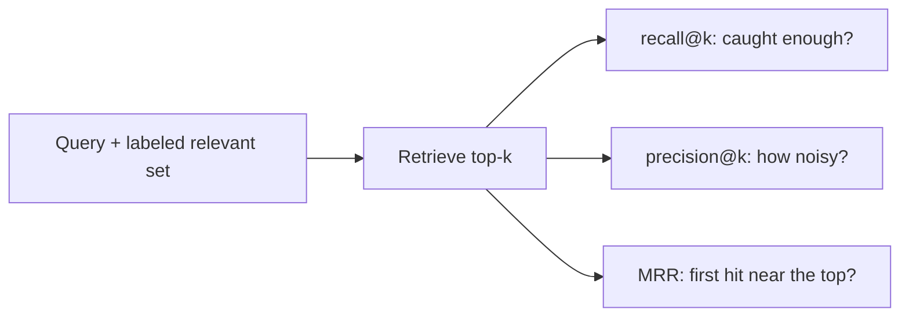

# Retrieval evals — metrics roadmap

## Roadmap: retrieval quality metrics

**What this section covers.** How to score the *retrieval* stage on its own — before generation ever
runs — so a bad answer points at the right fix. You build a labeled relevant set, take the top-k
results, and reduce them to a few honest numbers: recall@k, precision@k, and MRR.

**The ideas you'll meet:**

- **top-k** — the first `k` retrieved results, the window every retrieval metric is computed over.
- **recall@k** — relevant docs found in the top-k over *total relevant*; "did we catch enough of what mattered?"
- **precision@k** — relevant docs in the top-k over `k`; the noise cost of the window.
- **MRR** — mean reciprocal rank of the *first* relevant hit; rewards getting a good result to the top.
- **recall/precision tradeoff** — raising `k` can only help recall but usually admits more junk, lowering precision.

**Why it matters.** Scoring retrieval in isolation is the one lever that lets you blame a wrong answer
on the *right* stage — a fetch that missed, not a generation that drifted — instead of guessing.
