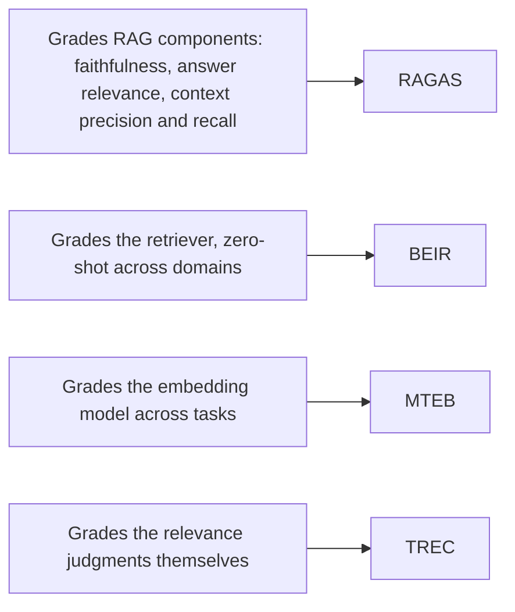

## The canon: RAGAS, BEIR, MTEB, TREC

**In brief.** Four names carry the prior art in retrieval evaluation, and they are easy to mix up
because they all produce numbers about retrieval. Each grades a **different layer** — placing them
correctly is what an interviewer is probing for.

**Key terms.**

- **RAGAS** (Exploding Gradients, 2023) — provides **RAG-specific evaluation metrics**: faithfulness,
  answer relevance, and context precision and recall. It scores a RAG pipeline's **components** rather
  than only its final answer, and it popularized reference-free RAG metrics. This is the framework
  people reach for when they want grounding and faithfulness numbers.
- **BEIR** (Thakur et al., 2021) — the standard **heterogeneous retrieval benchmark**: a suite of
  diverse IR tasks used to test how well a **retriever** generalizes **zero-shot** across domains. It
  exists because a retriever that wins on one corpus can lose badly out-of-domain.
- **MTEB** (Muennighoff et al., 2022) — the massive **embedding benchmark** and leaderboard, cited
  when comparing **embedding models** across many tasks. It grades the embedding, not the end-to-end
  answer.
- **TREC** — the classic **IR relevance methodology**: the pooled-judgment, human-labeled relevance
  tradition (qrels, graded relevance, pooling) that modern retrieval evaluation inherits, along with
  its labeling-cost problem.
- **The tools** — **RAGAS**, **TruLens**, **promptfoo**, and custom harnesses are what teams actually
  run retrieval evals with today.

**Why it matters.** Naming which layer each one grades — RAG components, retriever generalization,
embeddings, relevance judgments — is the fastest way to show you know the prior art, and it is what
stops a strong leaderboard score from being mistaken for a working pipeline.
