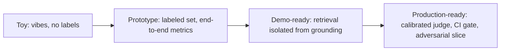

## Reviewing a retrieval-evals design

**In brief.** Every retrieval-eval decision is really a decision about how confidently, and how
cheaply, you can localize a bad answer to the right stage and catch a regression before it ships.
Reviewing one — in a design doc or an interview — means walking five independent levers and naming
what each one trades away.

**The five levers.**

- **Isolation** — **end-to-end** scoring versus **component-isolated** scoring. A single pass/fail on
  the final answer is cheap and trivial to wire up, but it conflates a retrieval miss with a grounding
  failure: when the number drops you cannot tell whether the right passage was never retrieved (a
  recall@k problem) or was retrieved and ignored (a grounding problem). Scoring the retriever
  (recall@k, precision@k, MRR, nDCG) separately from generation (faithfulness, grounding) is the
  single biggest structural lever — it costs an extra harness and a labeled relevance set, and it buys
  a regression that points at the stage to fix instead of a blind hunt.
- **Labels** — where relevance judgments come from: **human qrels** (TREC-style pooled judgments),
  **synthetic / LLM-generated** labels, or **implicit** signals like clicks and thumbs. Human labels
  are the gold standard and the bottleneck. Synthetic labels scale cheaply and are a legitimate way to
  bootstrap broad coverage, but with no human-validated slice the metric is grading the label
  generator's biases rather than the retriever. The fix is a human-labeled spot-check to calibrate
  them, not banning them outright. No labeled set at all means the retrieval metrics are unfalsifiable
  vibes.
- **Retrieval metric choice** — the metric must match the complaint. **recall@k** only asks whether
  the relevant doc is somewhere in the top-k and is blind to order: a passage at rank 1 and at rank k
  score identically. So "the right passage is present but buried" is a position problem needing an
  order-sensitive metric (**MRR** or **nDCG**), and the fix is usually **reranking** — lowering k just
  hides coverage rather than measuring order, and a bigger embedding model is not an eval change. A
  noisy window is a **precision@k** question. One metric for every failure mode is a flag.
- **Grounding and attribution judging** — how you score whether the answer used the context: an
  **NLI / entailment** model, an **LLM-as-judge**, or **human review**. Attribution adds a stricter
  per-claim span check on top of grounding. A judge whose agreement with humans is unmeasured, or
  attribution scored by **counting citations** instead of verifying that each cited span entails its
  claim, is false precision.
- **Gating** — what the eval is wired into: a one-off **report**, a **CI regression gate** on a golden
  set, or an **adversarial suite**. An eval that isn't gating anything drifts and rots.

**The review checklist.**

- Is it component-isolated, or is the only signal a single end-to-end pass/fail that cannot tell a
  retrieval miss from a grounding failure?
- Where do the labels come from — and is any synthetic slice validated against human judgment?
- Does the metric match the complaint, or is recall@k being asked to detect a ranking problem?
- Is the grounding or attribution judge calibrated against measured human agreement?
- What is the eval gating, and has the set gone stale enough for the system to overfit to it?

**Why it matters.** These five checks place any eval design on the toy → prototype → demo-ready →
production-ready ladder in minutes, and they name the antipatterns that sink a design review:
end-to-end-only scoring, unlabeled vibes, a blindly trusted judge, a stale set the system has taught
to the test, and counting citations instead of checking them.
