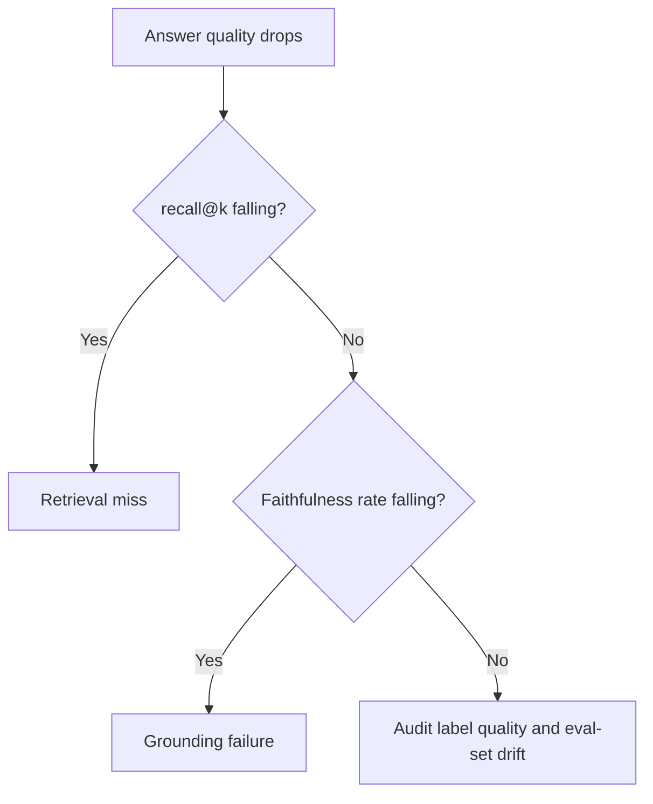

## The frontier and operating a live eval

**In brief.** recall@k tells you the right passage was in the window. It says nothing about whether
the answer was actually **supported** by that passage — and that gap is where every open problem
lives, and where the signals you watch once the eval is a live release gate are aimed.

**Where the frontier is.**

- **Faithful-grounding metrics beyond recall** — a retriever can hit recall@k and still yield an
  ungrounded answer, so faithfulness and grounding metrics are now mandatory, not optional. RAGAS
  popularized reference-free RAG-specific metrics that score the **components** rather than the final
  answer. What stays unsettled is **how** to score faithfulness: an **NLI / entailment** model versus
  an **LLM-as-judge**. Neither is settled, and the load-bearing warning is **false precision** — a
  confidently-scored faithfulness number can be more dangerous than an honest "unsure", because it
  hides the very regressions the eval exists to catch.
- **Cheap reliable labels** — human qrels are the gold standard and scale linearly with human hours.
  Synthetic and LLM-generated labels make evals cheap and broad but **bake in the generator's blind
  spots**; the explicit frontier method is to validate them against a human-labeled slice **before**
  trusting them, or the eval is measuring the judge, not the system. The durable claim: the true
  bottleneck in retrieval eval is **label quality, not compute** — so generating more synthetic labels
  until the numbers stabilize fixes nothing.
- **BEIR and MTEB generalization** — BEIR (Thakur et al., 2021) exists because a retriever that wins
  on one corpus can lose badly out-of-domain, so it measures **zero-shot generalization** across many
  IR tasks rather than a single leaderboard number. MTEB (Muennighoff et al., 2022) made "which
  embedding model" an evaluable question across tasks, but it grades the **embedding, not the
  end-to-end answer** — a strong score is necessary, not sufficient, for a good pipeline. Both inherit
  TREC's pooled-qrels tradition and its labeling-cost problem.
- **Attribution correctness at scale** — per-claim span and entailment checks are tractable in the
  small. The reliable version — trustworthy human review of every cited span — is too costly at
  production volume, and the cheap substitute, an LLM-judge, **drifts**: agreement degrades over time
  and across domains. There is no settled way to get correctness at scale, which is exactly why this
  is an open problem rather than a solved metric.
- **The honest best-effort stack** — automate the span check with an LLM-judge, **measure** inter-judge
  agreement, route low-agreement and randomly sampled cases into human audits, and monitor judge and
  label drift over time. This **bounds** the risk without closing the problem, so treating a confident
  judge score as proof and stopping the audits is the antipattern. Look for eval-of-the-eval work and
  agreement tracking, not a blanket "our judge is calibrated" claim.

**Signals to watch in production.**

- **recall@k and nDCG together** — track the retriever's recall@k (did we catch the relevant doc in
  the top k) and nDCG (graded and position-discounted — is the most relevant doc ranked first) as
  first-class release metrics, not offline curiosities. A buried-but-present regression moves nDCG and
  MRR while recall@k sits still, so watching only recall@k hides ranking rot.
- **Grounding and faithfulness rate** — the share of answers actually entailed by their retrieved
  context. This is the signal that separates a **retrieval miss** (recall@k drops) from a **grounding
  failure** (faithfulness falls while recall@k holds). The two have opposite fixes and a single
  end-to-end number cannot tell them apart, which is why you gate on both together.
- **Label-quality audits** — periodically re-check a slice of your relevance labels, especially
  synthetic ones, against human judgment, and track **judge-vs-human agreement over time**. Falling
  agreement means your ground truth is drifting and the whole eval is quietly measuring the judge.
- **Eval-set drift** — a static golden set the system silently overfits to (teaching to the test)
  rots: passing scores stop predicting production quality. Watch for a **widening gap between
  eval-set scores and real-world outcomes**, refresh the set, and keep an **adversarial slice** for
  known failure modes.

**Why it matters.** Gate on grounding and faithfulness rate alongside recall@k and nDCG so a miss and
a grounding failure stay distinguishable, and keep auditing labels and refreshing the set — an eval
that isn't validated against humans and kept current is measuring its own judge, not the system it
exists to protect.
