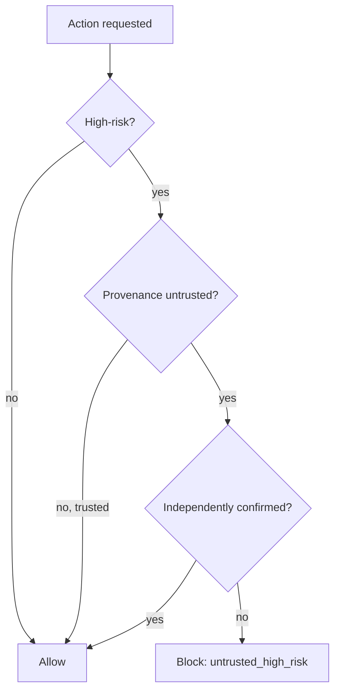

# Build it: provenance-aware authorization

## The confused deputy

An agent with powerful tools (send email, delete, transfer money) can be **tricked by untrusted
content** — a retrieved web page, a tool result, a user-supplied document — into performing a
high-risk action *with the agent's own privileges*. That's the **confused-deputy** problem, and it's
the core danger of **indirect prompt injection**: the attacker doesn't need your credentials, just to
get their instruction into content the agent reads.

You cannot reliably stop this with input filtering alone. The durable defense is to track each
action's **provenance** — did it originate from a *trusted* user request or from *untrusted* content?
— and refuse high-risk actions that trace back to untrusted content.

## The authorization rule

The rule is small and precise: **block** an action when it is **high-risk** AND its provenance is
**untrusted** AND it hasn't been **independently confirmed**. Everything else is allowed:

- **Trusted + high-risk** → allowed (the user asked for it).
- **Untrusted + low-risk** → allowed (reading is harmless).
- **Untrusted + high-risk** → **blocked** (`untrusted_high_risk`) — the confused-deputy case.
- **Untrusted + high-risk + confirmed** → allowed (an independent human/second-factor check overrides).

This is least-privilege applied to *provenance*: untrusted content can look at things, but it can't
make the deputy pull the trigger on a dangerous tool without an independent OK. It's one layer of
defense-in-depth, not the whole story — but it's the one that neutralizes the confused deputy.
