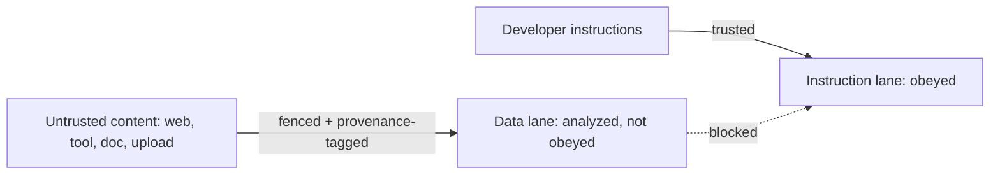

# Safety engineering — trust boundaries roadmap

## Roadmap: trust boundaries and design review

**What this section covers.** How to keep untrusted content in the *data* lane and out of the
*instruction* lane — trust boundaries, provenance tagging, and fencing — and then how to step back
and review a whole safety design across all its levers.

**The ideas you'll meet:**

- **Trust boundary** — the point where data crosses from a less-trusted source into the model's more-trusted instruction context.
- **Provenance / trust tagging** — labelling each span with where it came from so untrusted content can't be silently promoted to instructions.
- **Fencing** — delimiting an untrusted span and telling the model it is data to analyze, never instructions to obey.
- **Data lane vs. instruction lane** — the mental model that keeps fetched or tool content out of the authoritative channel.
- **The design space** — the five independent levers (provenance, fencing, filtering, least privilege, egress) combined into defense-in-depth.
- **Reviewing a design** — the toy → prototype → demo-ready → production-ready ladder and the review checklist.

**Why it matters.** The boundary layer is where a planted instruction is contained before it can act,
and reviewing a design against every lever is the exact skill an interviewer or staff engineer probes.
