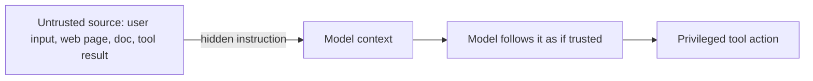

# Safety engineering — prompt injection roadmap

## Roadmap: prompt injection

**What this section covers.** The defining attack against LLM systems — how untrusted text smuggles
in instructions the model follows as if they were the developer's own — why you cannot simply filter
it away, and the canon of people and papers that named the threat.

**The ideas you'll meet:**

- **Prompt injection** — untrusted input smuggling in instructions the model obeys as if they were the developer's; the model treats all context as equally authoritative text.
- **Direct injection** — the malicious instruction arrives in the user's own input.
- **Indirect injection** — the instruction is planted in content the system reads later (web page, document, email, tool result); the dangerous class in agents.
- **Why filtering alone fails** — no robust general injection classifier exists; payloads can be rephrased, encoded, or split past any fixed pattern.
- **Defense-in-depth** — filtering is one layer among several, not the whole defense.
- **The canon** — Simon Willison (coined "prompt injection", 2022), Greshake et al. (indirect injection, 2023), and the OWASP LLM Top 10 risk checklist.

**Why it matters.** Injection is the root threat every later section defends against; naming it as a
confused-deputy authorization problem — not a detection problem — is what separates a shallow answer
from a senior one.
