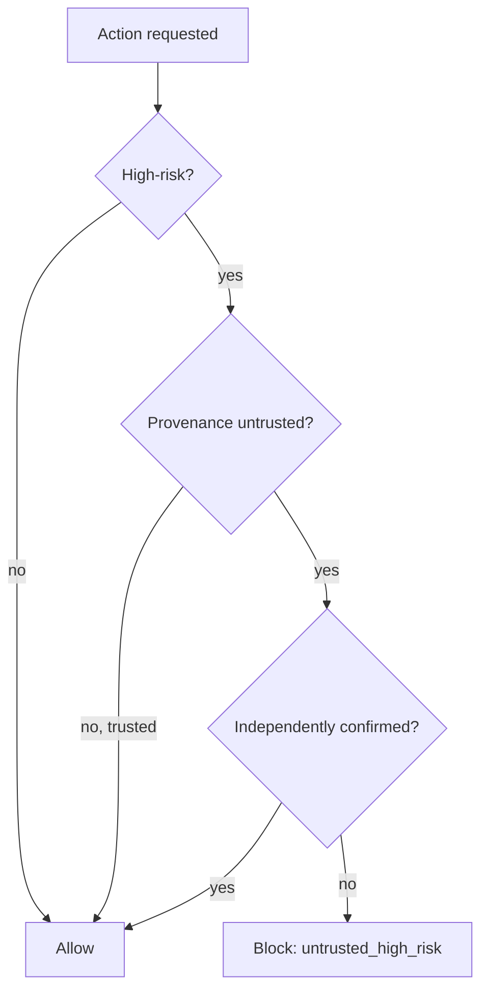

# Safety engineering — permissions roadmap

## Roadmap: permissions and operating in production

**What this section covers.** The layers that limit what an attack can *do* once it lands — least
privilege, egress control, and provenance-aware authorization that neutralizes the confused deputy —
plus the signals you watch when the system is live.

**The ideas you'll meet:**

- **Data leakage / exfiltration** — sensitive data reaching a destination it should never go to; a data-flow failure, not just what the model says.
- **Least privilege** — scoping each tool to the minimum access it needs, shrinking the blast radius of a hijacked turn.
- **Blast radius** — the damage a single compromised turn can do.
- **Egress control** — gating every data-out step behind an allow-list and/or human confirmation.
- **Confused deputy** — the agent misusing its own legitimate authority on an attacker's behalf.
- **The authorization rule** — block an action that is high-risk AND untrusted AND unconfirmed (`untrusted_high_risk`).
- **Operational signals** — blocked-egress rate and tool-permission-denial rate as leading indicators, watched against the incident-vs-false-positive tension.

**Why it matters.** These are the last lines of defense: even a successful injection cannot exfiltrate
or take a dangerous action if egress is gated and tools are least-privilege — and knowing which signal
leads tells you when an attack is in flight.
