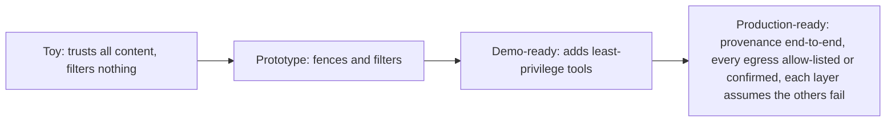

## Reviewing a safety design

**In brief.** There is no robust general injection defense, so a safety design is never judged on how
well it **detects** an attack. It is judged on how little an attack can accomplish once untrusted
content reaches the model. Reviewing one means walking five independent levers and checking that
**containment** — not a classifier — carries the boundary.

**The five levers.**

- **Provenance / trust tagging** — track where every span came from. Developer instructions are trusted; web pages, retrieved documents, tool outputs, and user uploads are untrusted, and untrusted content must never be silently promoted to authoritative instructions. Without a trust tag, no downstream control can enforce a boundary at all. Costs discipline: every source must be tagged and the tag threaded through.
- **Fencing** — enforce the boundary at the prompt level: delimit the untrusted span, label it, and instruct the model that content inside is data to analyze, never instructions to obey. A real mitigation, never airtight on its own — the prompt channel alone cannot be trusted. Costs tokens on every request that reads untrusted content.
- **Filtering / detection** — scan input and output for known payloads. Worth doing, but evadable: an attacker rephrases, encodes (base64, homoglyphs), or splits the payload past any fixed pattern. It is one layer, never **the** layer. Costs a call and latency on the hot path, and false positives block real users.
- **Least privilege** — scope each tool to the minimum access it needs. A read-only tool cannot write; a token scoped to one mailbox cannot reach billing; a network-less tool cannot call an attacker's URL. This shrinks the **blast radius** of a compromised turn. Costs operational overhead, not tokens — the payoff is that blast radius stays constant as you add tools.
- **Egress control** — gate every data-out step (HTTP, email, external write, webhook) behind an **allow-list** and/or **human confirmation**. This is the last line: even a successful injection is stopped at the wire if the destination is not allowed. Costs friction on legitimate sends, so reserve confirmation for genuinely high-risk boundary-crossing actions.

**The review checklist.**

- Is untrusted content ever pasted into the instruction channel? Retrieved or tool content promoted to instructions is an immediate flag — it is the direct line for indirect injection, and the fix is to fence the span as labeled data and tag its provenance as untrusted. Truncating or caching it addresses nothing.
- Is provenance tracked at all, or is trusted indistinguishable from untrusted?
- Is filtering treated as the whole defense? A single classifier as the boundary is the classic antipattern.
- What is each tool's blast radius? Broad credentials mean a hijacked turn does real damage.
- What happens at egress? A real design names its allow-list and/or confirmation for every data-out step — never "the filter will catch it."

**Why it matters.** These five checks place any design on the toy → prototype → demo-ready →
production-ready ladder in minutes, and they name the antipatterns that sink a design review:
trusting retrieved or tool content, a single-filter defense, an over-privileged agent, and
unconstrained egress. Each passes a demo and becomes a confused-deputy exfiltration path under real
traffic — a broadly scoped token plus arbitrary outbound HTTP behind nothing but a filter is exactly
that path, and the fix is to bound the token and gate the send, not to rotate the token faster.
