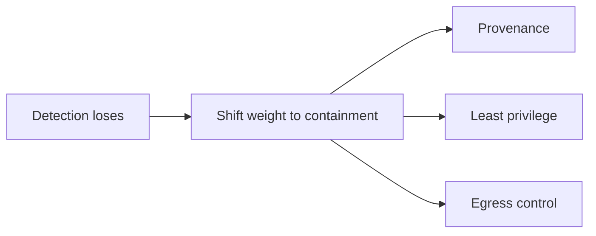

## The frontier & operating safety in production

**In brief.** LLM safety is an open problem, not a solved one, and every serious direction accepts the
same premise: **detection loses**. Knowing which fronts are still moving, and which signals to watch
once the system is live, is what separates someone who **knows** safety engineering from someone who
**runs** it.

**Where the frontier is.**

- **No robust general injection defense** — the standing open problem, and it is load-bearing. No classifier reliably stops injection in the general case, because a determined attacker rephrases, encodes, or splits the payload past any fixed pattern. So "we added an injection filter" is never a finished answer, and any "solved" claim deserves deep skepticism. The honest direction is not a better detector but **containment** — provenance, least privilege, and egress control so that a **successful** injection still cannot do damage. Note what the answer is not: the fix is neither a bigger model nor abandoning external content.
- **Indirect and agent injection** — the dangerous class is not the payload a user types but the one planted in retrieved pages, documents, emails, or tool return values the agent reads **later**. Input-side filtering is blind to it because the attacker never touches the prompt. As agents gain tools, **every external source becomes attack surface**, which is why this threat is load-bearing in agentic systems specifically and why the frontier is agentic, not chatbot-shaped.
- **Provenance at scale** — easy in a toy, unsolved in production. Tagging one span is trivial; the hard part is keeping the trusted/untrusted tag **alive** as content flows through retrieval, summarization, and multi-hop tool calls. A summary of an untrusted document is still untrusted, but most pipelines quietly launder that provenance away — and once the tag is gone, no downstream control can enforce a boundary.
- **Agent egress control** — as agents gain data-out tools, the frontier moves to bounding what can **leave**: allow-listed egress and confirmation gates treated as first-class architecture, not add-ons bolted on after a demo.
- **The OWASP LLM Top 10** — the field's risk checklist, and its evolution is itself a frontier signal: prompt injection stays entrenched at the top across releases, and the agent-era categories it has grown (excessive agency, system-prompt leakage, unbounded consumption) show where consensus is moving.

**Signals to watch in production.**

- **Blocked-egress rate** — how often a data-out step is stopped by the allow-list or a failed confirmation. This is the signal that your **last line** is doing work. A rise on a previously quiet endpoint is the strongest leading indicator of an exfiltration attempt in progress: something got far enough to try to send data out.
- **Tool-permission-denial rate** — how often a least-privilege check refuses a call the model wanted to make. Denials are healthy — they are blast radius being enforced — but a sharp climb reads two ways: either an attack is driving the agent toward capabilities it should not have, or your scopes are too tight for legitimate work. The shape of the trend tells you which; loosening every scope until denials stop is the wrong reflex.
- **Injection-attempt detection rate** — how often filters flag a suspected injection. A **trend and triage** signal only: a spike means active probing, but because no classifier catches every rephrasing, a low rate can mean "quiet" **or** "being evaded." Never read it as proof of safety, and never read it alone.
- **Incident and false-positive rate** — the two error signals in tension: confirmed incidents (an injection that caused a bad action or a leak) versus legitimate users and sends blocked. You tune the whole stack against both — incidents toward zero, false positives low enough that people do not route around the controls.

**Why it matters.** Alert on **blocked-egress** and **tool-permission-denial** as the leading
indicators of an attack in flight, read injection-attempt detection only as a trend, and tune against
the incident-versus-false-positive tension — never treating a quiet detector as evidence the boundary
is holding.
