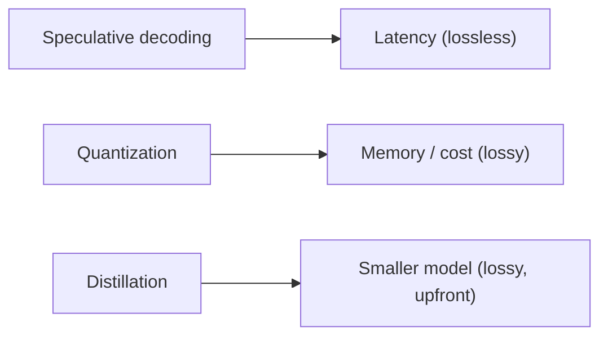

# Speculative decoding, quantization & distillation — levers roadmap

## Roadmap: three levers, three goals

**What this section covers.** The three distinct levers for making inference faster or cheaper —
speculative decoding, quantization, and distillation — what goal each one actually serves, and the
single question that separates them: what each costs you in output quality.

**The ideas you'll meet:**

- **Speculative decoding** — the latency lever; makes responses come back faster without changing what the model says.
- **Quantization** — the memory/cost lever; stores weights at lower bit-width (INT8, INT4) so the model fits and runs cheaper.
- **Distillation** — the smaller-model lever; trains a small **student** to mimic a large **teacher** for a permanently cheaper model.
- **Lossless vs lossy** — the sharpest way to tell the levers apart: only speculative decoding leaves output quality untouched.
- **Lever/goal matching** — diagnose the *goal* (latency vs. memory/cost vs. size) first, then pick the lever that serves it.
- **Composition** — the levers attack different axes, so they stack: a common order is distill → quantize → speculate.

**Why it matters.** Most real mistakes here are lever/goal mismatches — reaching for the tool that
does not solve the problem in front of you — so naming the goal before naming the tool is the whole
skill.
