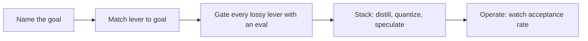

# Speculative decoding, quantization & distillation — review roadmap

## Roadmap: reviewing, operating & the frontier

**What this section covers.** How a senior engineer combines the three levers under a real SLO,
critiques someone else's inference-optimization design, tracks where the research frontier is moving,
and watches the operational signals that tell you whether a live speedup is real and holding.

**The ideas you'll meet:**

- **Tradeoff table** — name the lever, name what it costs, name the regime where it wins.
- **Common to SOTA to antipattern** — the ladder from one well-matched lever, to eval-gated stacking, to reaching for the wrong lever.
- **Self-speculative heads** — Medusa and EAGLE fold the drafter into the target so there is no separate draft model to serve or align.
- **Eval-gated stacking** — prove each lossy stage (distill, quantize) behind a task eval before the next stage lands.
- **Acceptance across domains** — the live open problem: a drafter that accepts well on code may accept poorly on prose.
- **Operational signals** — acceptance rate, accepted tokens per step, wall-clock speedup vs. quality delta, and throughput under load.
- **The canon** — Leviathan et al. and Chen et al. (2023) for speculative decoding; Medusa/EAGLE for self-speculation; Hinton et al. (2015) for distillation.

**Why it matters.** Matching each lever to its goal, gating every lossy change with an eval, and
knowing which signals to watch in production is exactly what reads as senior in a design review or an
interview.
