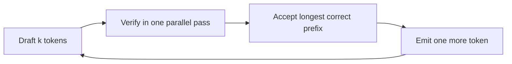

# Speculative decoding, quantization & distillation — specdec roadmap

## Roadmap: speculative decoding

**What this section covers.** How speculative decoding breaks the serial bottleneck of
autoregressive generation with a draft-and-verify loop, why it is lossless, and how to count the
tokens it produces per verification pass — the metric the whole speedup rides on.

**The ideas you'll meet:**

- **Draft model** — a small, cheap model that runs ahead and proposes several candidate tokens at once.
- **Target model** — the large model that verifies the whole drafted run in a single parallel forward pass.
- **Accept the longest correct prefix** — keep the drafted tokens up to the first mismatch, then substitute the target's own token.
- **Lossless** — accepted tokens are exactly what the target would have produced alone, so quality is unchanged.
- **Acceptance rate** — the fraction of drafted tokens the target verifies as correct; a poor draft yields little speedup or even a slowdown.
- **Accepted tokens per step** — leading matches plus one; the number the speedup actually scales with.

**Why it matters.** Speculative decoding is the only lever that buys latency at zero quality cost —
but its entire economics live in the acceptance rate, so knowing how to count accepted tokens is
knowing when the lever pays off.
