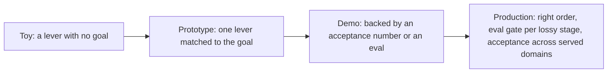

## Reviewing an inference-optimization design

**In brief.** Every inference-optimization decision is really a decision about which axis you are
buying down — latency, memory/cost, or model size — and how much quality risk you will pay for it.
Reviewing one means checking that the lever matches the stated goal, that any speedup claim is backed
by an acceptance number, and that every lossy stage is gated by a task eval.

**What each lever costs.**

- **Speculative decoding** — buys **latency** and nothing else, and does it **losslessly**. It never reduces memory, never shrinks the model, never changes the output — and it **adds a draft model to serve and keep aligned**. Reaching for it on a memory or cost problem is the classic wrong-lever antipattern: it shrinks nothing and adds a second model. Objecting that it is "lossy" is wrong too.
- **Quantization** — buys a smaller footprint and cheaper compute by storing weights at lower precision (INT8, INT4). **Lossy**: rounding perturbs the model. Reach for it when the model barely fits, not to "fix" a latency-bound decode.
- **Distillation** — buys a **permanently smaller** student model. **Lossy and upfront**: a training project, not a config flag. The student freezes what it learned at training time, so distilling volatile knowledge goes stale — that is a retrieval problem.
- **Composition** — the levers attack different axes, so they do compose, and `distill -> quantize -> speculate` is the standard order. Each stage compounds the win; every lossy stage before it compounds the quality risk.

**Why a speedup claim needs an acceptance number.**

- **The speedup is acceptance-bound, not draft-size-bound.** It scales with **accepted tokens per verification pass** — plan and report it in that unit, never in "the draft is 10x smaller". A fast but frequently-rejected draft advances only a token or two per expensive verify.
- **The per-step ledger.** Every step pays to run the draft **and** to run the target's verify pass; what you earn back is only the accepted tokens. With low acceptance you paid both and advanced almost nothing, so the speedup shrinks and can even go **negative** — verifying rejected drafts is wasted work. This is why the drafter is defined as small and cheap: its cost is charged on every step, accepted or not.
- **Acceptance is domain-dependent**, so a number measured on one workload does not generalize. Require it on the workload actually served.
- **No acceptance number means the claim is unbacked** — demo-grade at best, whatever the draft-to-target size ratio. A faster or smaller draft does not fix low acceptance.

**Where the eval goes.**

- Every **lossy** lever needs a **task eval** — not perplexity alone, and not a short-prompt smoke test standing in for a real one. Quantization error is non-linear in bit-width: INT8 usually holds quality, while INT4 can drop it sharply on reasoning-heavy or long-context tasks.
- When levers are stacked, **distill and quantize are both lossy and their errors compound**, so a single end-to-end check can mask a real task regression and cannot attribute it to a stage. Gate **each** lossy stage behind its own task eval so a regression is attributable to the lever that caused it. Speculative decoding is lossless, so it spends no quality in the stack.

**The review checklist.**

- What goal are we actually chasing — latency, memory/cost, or size? A plan that names a lever before naming a goal is the wrong-lever antipattern in the making.
- Does the lever match the goal? Speculative decoding on a memory problem, or quantization on a latency-bound decode, is an immediate flag.
- For speculative decoding: what is the acceptance rate, and on which workload?
- For every lossy lever: where is the task eval?
- If levers are stacked, is the order right and is each lossy stage measured?

**Why it matters.** Rating a design as toy, prototype, demo-ready, or production-ready comes down to
these answers: a toy names a lever with no goal, a prototype matches one lever to the goal, a demo
backs it with an acceptance number or an eval, and a production-ready design stacks in the right
order, gates every lossy stage behind a task eval, and reports acceptance across the domains it
actually serves.
