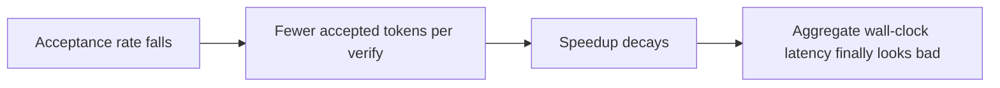

## The frontier & operating the levers live

**In brief.** The research edge and the production dashboard circle the same number: **acceptance**.
The frontier is making the draft cheaper and higher-acceptance, and stacking the levers without
compounding degradation. Operating them live means watching the handful of signals that say whether
the speedup is real and whether it is holding.

**Where the frontier is.**

- **Self-speculative heads — folding the drafter into the target.** First-generation speculative decoding (**Leviathan et al.** at Google, **Chen et al.** at DeepMind, 2023) needed a **separate** draft model to serve and keep aligned with the target. The frontier removed that. **Medusa** (Cai et al., 2024) attaches extra prediction heads to the target so it drafts several future tokens itself; **EAGLE** drafts from the target's own internal features. The shared move is that the drafter is **part of** the target rather than a standalone model — no second model to serve or drift out of sync, and in-domain acceptance tends to be higher. It stays **lossless** and still latency-only. The open question was "where does the draft come from," and self-speculative heads are the answer the field converged on.
- **High acceptance across domains — still open.** Speculative decoding's speedup is **acceptance-bound**: it scales with accepted tokens per verification pass, not with how small the drafter is. And acceptance is **domain-dependent** — a drafter that accepts well on code can accept poorly on prose or long-tail reasoning. A single acceptance measurement from one workload does not generalize, so holding acceptance up across domains is the live problem that decides whether the technique pays off. Acceptance is not fixed by the target model, and higher acceptance never costs quality.
- **Combining levers without quality loss.** The common order is `distill -> quantize -> speculate`. **Distill and quantize are the lossy stages** and can degrade quality; the **speculate stage is lossless** and adds latency wins at zero quality cost. The frontier discipline is **eval-gated stacking**: prove each lossy stage behind a task eval before the next lands, so a regression is attributable to the stage that caused it.

**Signals to watch in production.**

- **Draft acceptance rate** — the headline gauge and the **leading indicator**. It is the fraction of drafted tokens the target verifies and accepts. It falls when traffic shifts to a domain the drafter is weak on, and it moves **before** aggregate wall-clock latency looks bad, which is why it is the metric to alert on.
- **Accepted tokens per verification step** — acceptance rate times draft length: how many tokens you advance per expensive target pass. This is the number the speedup actually scales with, so plan and monitor in this unit.
- **Wall-clock speedup vs. quality delta** — read the two together, never speedup alone. A purely speculative change must show speedup with a **zero** quality delta, because the lever is lossless; any measured quality change means a bug or a lossy verification relaxation crept in. For the lossy levers, the task eval's quality delta is the gate, and a footprint win with an unmeasured quality delta is a silent regression waiting to ship.
- **Throughput under load** — speculative decoding trades extra compute (verifying drafts, including rejected ones) for latency. Under high load that extra verify work competes for the same GPU, so the per-request latency win can shrink or even invert as batch pressure rises. Measure throughput and tail latency at the offered load you actually serve, not on a single idle request.

**Why it matters.** Alert on acceptance rate as the leading indicator that a speculative speedup is
decaying, read wall-clock speedup only alongside its quality delta — zero for the lossless lever,
eval-gated for the lossy ones — and never trust a single-request latency number, because the
acceptance economics change once the batch fills up.
