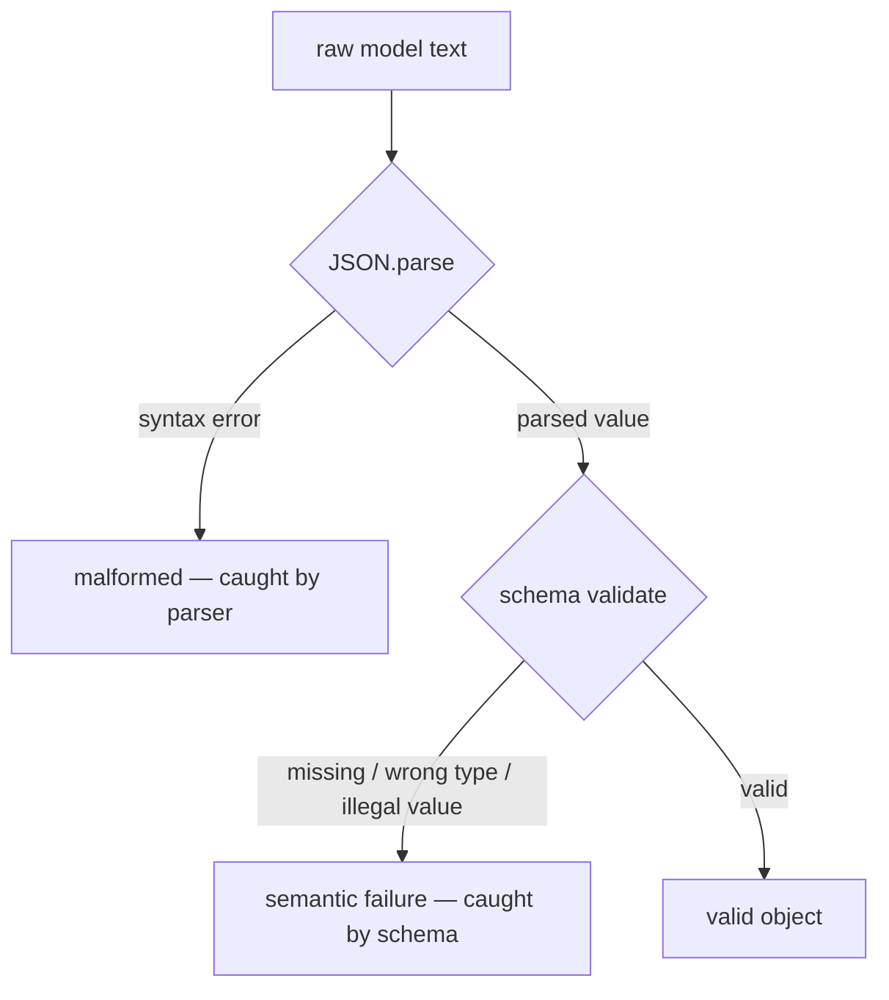

# Validation: the contract and its enforcement

## Parse, then validate

The safe way to consume model JSON is two explicit steps: **parse, then validate.**

1. **Parse** the text into a data structure (`JSON.parse`), catching syntax errors — this is where
   *malformed* output is caught.
2. **Validate** the parsed value against an explicit schema — this is where *semantic* failures
   (missing fields, wrong types, illegal values) are caught.

The two gates catch different failure classes with different tools:

The two anti-patterns to avoid are **regex-scraping** fields out of the raw text (fragile, silently
wrong) and **`eval`-ing** the string (unsafe). Parse-then-validate is the only approach that fails
loudly and precisely.

## The schema is the contract

Treat the **schema as the single authority on what a valid output is** — "schema as contract." Every
other mechanism (repair, fallback) exists to *serve* the schema, not to second-guess it. In
TypeScript this is typically a **Zod** schema (others: Ajv, Valibot, Yup); the schema both validates
at runtime and gives you a static type for free.

A practical corollary: **stricter contracts catch more but also fail more.** Adding many required
fields with tight types raises the validation-failure (and therefore repair) rate. Make fields
required because they matter, not by default — and budget for the repairs that strictness creates.

## Constrained decoding and its limits

You can *prevent* many failures at the source with **constrained decoding** (a.k.a. grammar-based
decoding, `response_format`, or "JSON mode"): the decoder is restricted to tokens that keep the
output valid against a grammar/schema shape. This largely eliminates *syntax* failures.

But constrained decoding has a hard limit: **it constrains form, not meaning.** It can guarantee
well-formed, schema-shaped JSON, yet the model can still emit a wrong enum value, an out-of-range
number, or a value that violates a business rule — all syntactically valid. There is also a
**quality cost**: aggressive constraints can steer the model away from better completions.

The lesson: constrained decoding is a valuable *first* layer, but you **still validate** afterward.
Prevention and validation are complementary, not substitutes.
