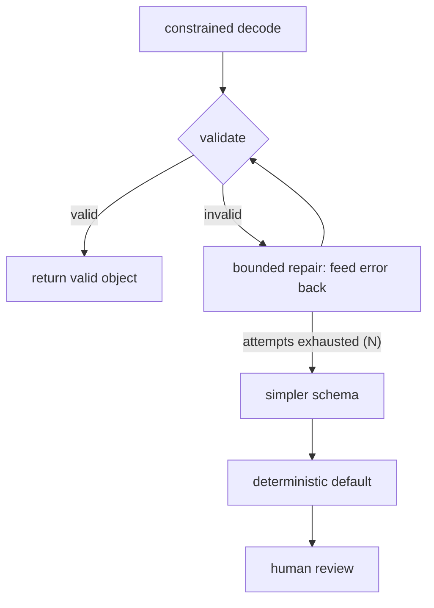

# Recovery: repair and fallback

## Repairing invalid output

When validation fails, the cheapest effective recovery is a **repair loop**: send the model its own
invalid output *plus the validation error* and ask it to fix it. Feeding back the concrete error
("`status` must be one of open|closed, got 'pending'") is what makes repair work — the model gets a
precise, actionable correction rather than a vague retry.

Repair is the *first* response to a validation failure — not crashing, not silently accepting, and
not immediately escalating to a bigger model.

## Bounding the repair loop

A repair loop must be **bounded**. Some outputs are simply unrepairable, and an unbounded loop burns
latency and money forever. So cap it: at most *N* repair attempts, then stop. A loop capped at *N*
makes at most *N* extra model calls before giving up — a predictable, budgetable cost.

"Bounded" is the difference between a repair loop and a bug: the same code with no maximum is an
`while (true)` waiting to happen.

## Fallback chains

When repair is exhausted, you **fall back** rather than fail. A fallback chain runs from cheapest and
most automated to most expensive, ending in something safe:

**constrained decode → validate → bounded repair → simpler schema → deterministic default → human review**

Each step is a smaller promise than the last: try to get the full structure; if not, a simpler one;
if not, a safe default value; and only then a human. The chain guarantees the caller always gets
*something valid* — never a crash and never a silently-wrong result.

Putting it together, robust structured output is four layers: **prevent** (constrained decoding),
**validate** (schema as contract), **repair** (bounded, error-fed), and **fall back** (a safe chain).
Budget each layer, log the failures, and the "the model usually returns valid JSON" gamble becomes an
engineered guarantee.
