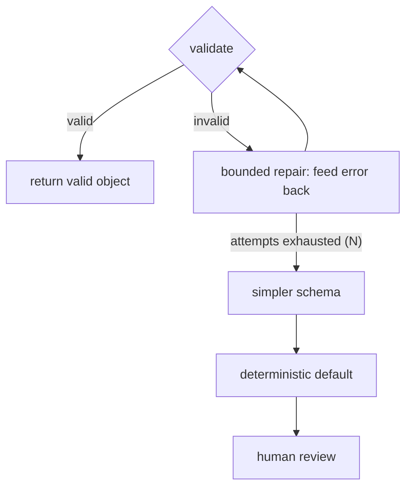

# Structured output reliability — recovery & operations roadmap

## Roadmap: recovery and operating the pipeline

**What this section covers.** What to do when validation fails, and how to run the whole thing in
production. You'll meet the bounded, error-fed repair loop and the fallback chain, then zoom out to the
design space, its tradeoffs, and the operational signals that tell you where to invest next.

**The ideas you'll meet:**

- **Repair loop** — the first response to a validation failure: send the model its own invalid output *plus the concrete error* and ask it to fix it.
- **Bounded** — cap the loop at *N* attempts; the same code with no maximum is a `while(true)` bug.
- **Error-fed** — feeding the concrete validation error back is what makes repair work, versus a blind retry.
- **Fallback chain** — constrained decode → validate → bounded repair → simpler schema → deterministic default → human review, ordered cheapest-and-most-automated first.
- **Design space & tradeoffs** — the five levers (prevention, contract, recovery, degradation, observability) and what each buys and costs.
- **Common / SOTA / antipattern** — the ladder for judging a design, from prompt-and-hope to the full logged, classified stack.
- **Operational signals** — schema-validation failure rate (by class), repair-attempt rate, and fallback rate — the leading indicators that the contract is slipping.

**Why it matters.** Recovery and observability are what turn a pile of layers into an *engineered
guarantee*: the caller always gets something valid, and you can see where the tail failures are coming
from instead of tuning blind.
