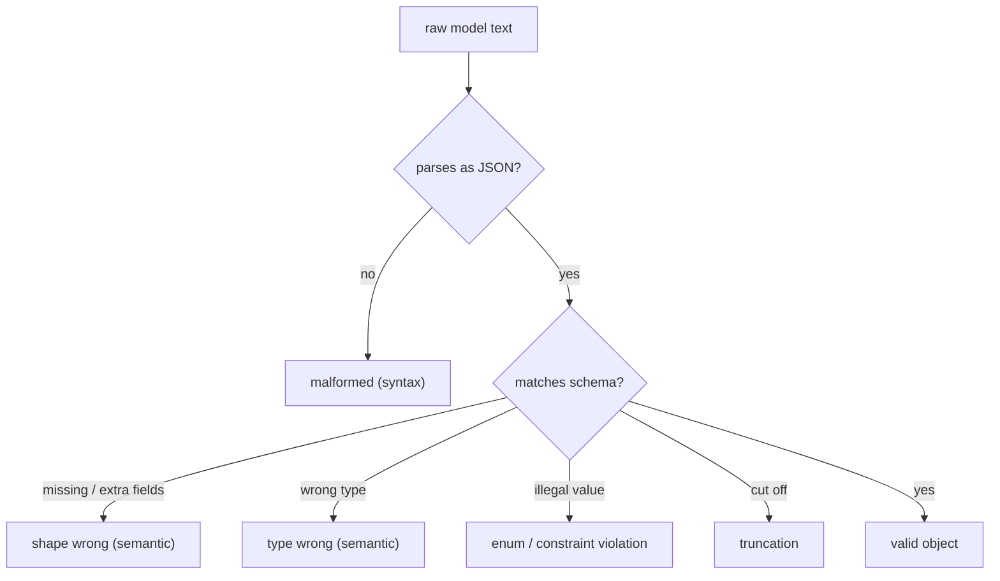

# Structured output reliability — failure-taxonomy roadmap

## Roadmap: how structured output fails

**What this section covers.** Before you can make structured output reliable you have to name the ways
it breaks. This section builds the vocabulary: the split between *syntax* and *semantics*, and the
specific failure classes each layer catches.

**The ideas you'll meet:**

- **Syntax vs. semantics** — is the text parseable at all (syntax), versus does the parsed value match your schema (semantics)? They fail independently and different tools catch them.
- **Malformed output** — not parseable JSON; the only *syntax* failure, caught by the parser.
- **Missing / extra fields** — it parses but the shape is wrong; caught by the schema validator.
- **Wrong types** — a number where a string is required, `"true"` instead of `true`.
- **Constraint / enum violation** — a value outside the allowed set; parses and the field exists, but the *value* is illegal.
- **Truncation** — the response is cut off mid-structure, usually because it hit the `max_tokens` output cap.
- **Hallucinated values** — plausible-looking but fabricated content that passes both parser and schema.

**Why it matters.** You cannot detect, log, or recover from a failure you can't name — this taxonomy is
the diagnostic vocabulary every later layer (validation, repair, fallback) is built to act on.
