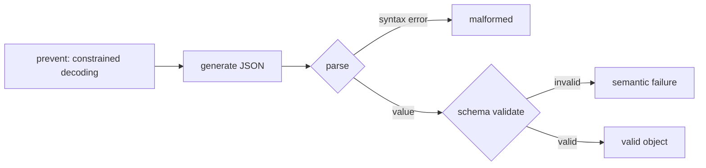

# Structured output reliability — validation roadmap

## Roadmap: validation and constrained decoding

**What this section covers.** The load-bearing layer: how you *enforce* a contract on model output.
You'll meet parse-then-validate, the schema as the single authority, and constrained decoding — the
prevention layer that guarantees form but not meaning — plus the canon of tools and interview signals
that surround them.

**The ideas you'll meet:**

- **Parse, then validate** — two explicit gates: `JSON.parse` catches syntax errors, then a schema catches semantic ones. Never regex-scrape or `eval` the string.
- **Schema as the contract** — the schema is the single authority on what a valid output is; every other layer serves it.
- **Zod / Pydantic / Ajv** — schema/validation libraries that validate at runtime and hand you a static type for free.
- **Strictness tradeoff** — more required fields and tighter types catch more but also *fail* more, raising the repair rate.
- **Constrained decoding** — a.k.a. grammar-based decoding / JSON mode / `response_format`; restricts the decoder to tokens that keep the output valid, largely eliminating *syntax* failures.
- **Shape vs. meaning** — constrained decoding guarantees form, not meaning; a valid-shaped output can still hold an illegal value, so you *still validate*.
- **The canon** — Outlines (finite-state constrained decoding), Instructor / jsonformer (schema-first extraction), and provider JSON mode.

**Why it matters.** Validation is the layer that turns "the model usually returns valid JSON" into a
loud, precise contract — and knowing to validate *on top of* constrained decoding is the difference
between a shallow answer and a senior one.
